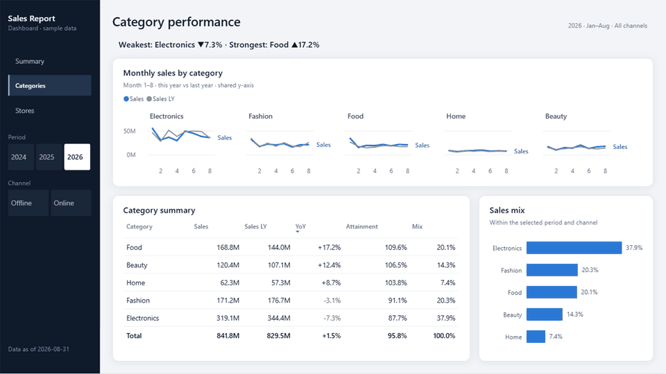
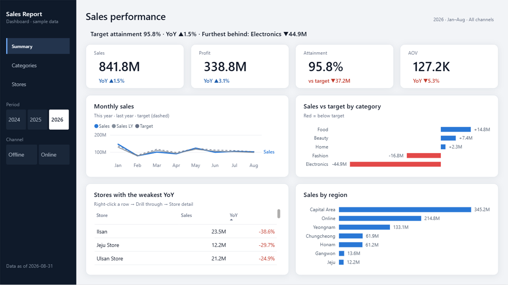
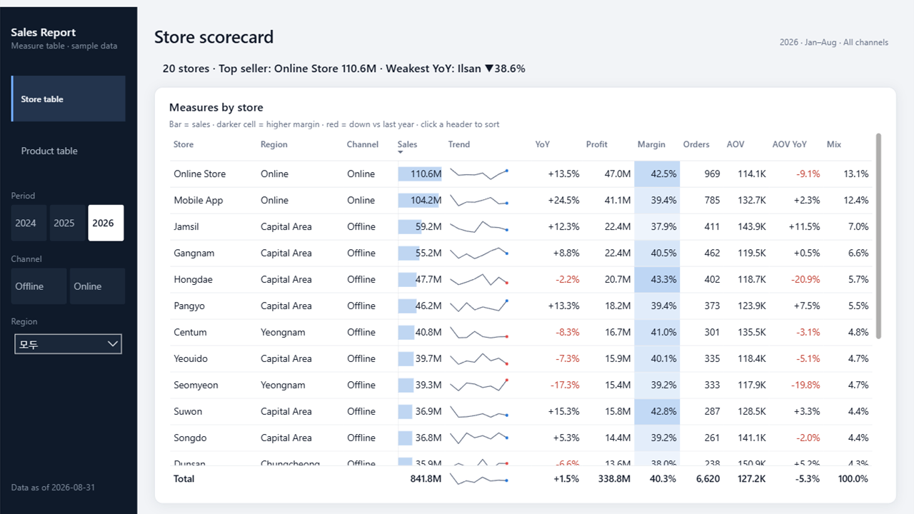
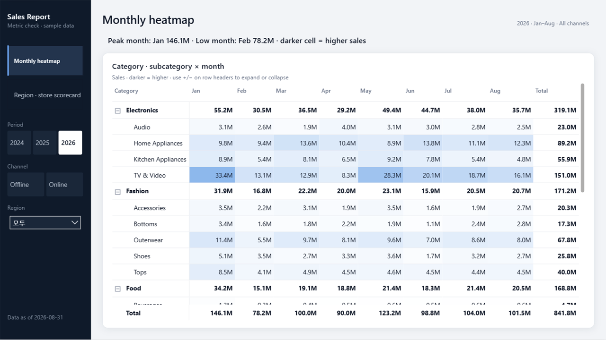
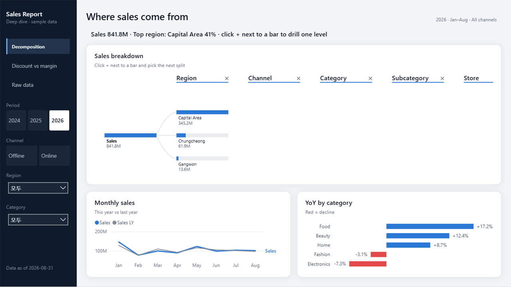
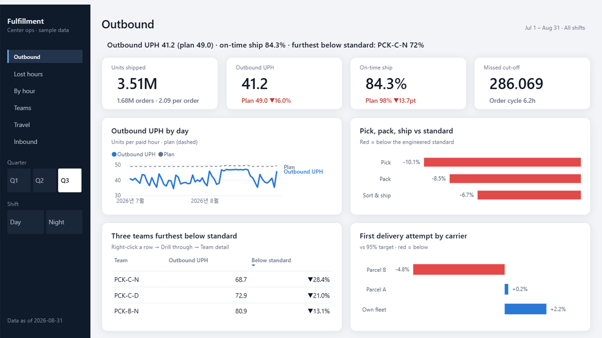
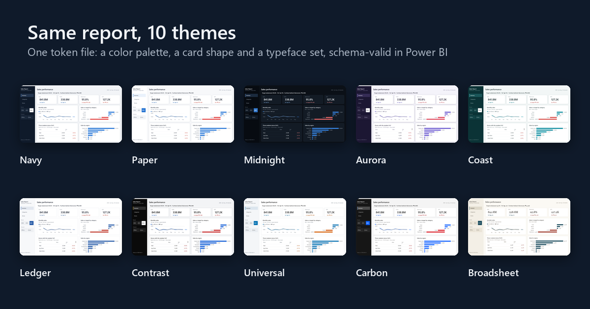

# powerbi-autopilot

[](https://github.com/Haweee47/powerbi-autopilot/actions/workflows/check.yml)
[](https://github.com/Haweee47/powerbi-autopilot/releases)
[](LICENSE)
[](docs/guide/ko.md)
[](CHANGELOG.md)
[](https://github.com/Haweee47/powerbi-autopilot/discussions)

[English](README.md) · **한국어**

요청 한 줄로 Power BI 리포트를 **데이터 모델 → 디자인 → 검증**까지 처음부터 끝까지 만드는 AI 에이전트 워크플로우.
Power BI Desktop에서 손으로 조작하지 않는다.

**핵심은 분석가가 대시보드 만들기가 아니라 분석에 시간을 쓰게 하는 것이다.** 데이터 분석가(DA)와 비즈니스 분석가(BA)는 비주얼 배치, 서식,
깨진 화면 고치기에 많은 시간을 쓴다. 이 프로젝트는 그 일을 요청 한 줄로 줄여, 그 시간을 본업인 데이터 분석과 비즈니스 분석에 돌리고
비즈니스 임팩트를 높이는 것을 가장 먼저 목표로 한다. 그러면서 두 가지 기준을 지킨다. **보기 좋은 리포트**, 그리고 **적은 토큰**.



---

## 왜 만들었나

대시보드를 만드는 데 쓰는 시간은 분석가가 그 뒤의 질문, 즉 무엇이 바뀌었나, 왜, 다음에 무엇을 할까에 써야 할 시간이다.
그런데 그 시간의 대부분은 분석이 아니다. 비주얼 배치, 서식, 깨진 화면 고치기, 리포트끼리 모양 맞추기다.
이 시간을 줄이는 것이 첫 번째다. 분석가가 비즈니스 임팩트를 만드는 곳은 분석이고, 시간은 그곳에 가야 한다.

이전 직장에서 기존 Power BI 리포트를 PBIP(텍스트 형식)로 바꿔 LLM에게 읽히고, 템플릿을 참고해 새 리포트를 만들게 하는 방식을 직접 설계해 팀에 배포했다.
리포트는 만들어졌다. 하지만 실무에서 계속 쓰기에는 두 가지가 걸렸다.

1. **토큰이 너무 많이 들었다.** 리포트 몇 개를 "학습"시키려면 매번 수십만 토큰을 읽어야 했다.
2. **결과물이 예쁘지 않았다.** 기존 리포트를 따라 하니 기존 리포트 수준의 디자인이 그대로 나왔다.

그래서 이 문제를 공개 데이터로 처음부터 다시 풀고 있다. 모든 과정은 [진행 기록](docs/progress-log.md)에 남긴다. 결정한 것, 틀린 가설, 실패까지 전부다.

## 어떻게 쓰나

새 리포트를 부탁하면 에이전트가 세 가지만 묻는다. **용도, 테마, 언어.**
그다음 미리 만들어 둔 파일럿을 복사해 필드와 문장만 바꾸고, 생성·검증·Desktop 캡처까지 한다 ([스킬](.claude/skills/new-report/SKILL.md)).

```bash
python tools/new_report.py --purpose table --theme paper --lang ko --name StoreKPI   # 파일럿 복사 (명세 1.6K 토큰)
python tools/generate_pbir.py examples/StoreKPI/report.spec.json                      # PBIP 생성
powerbi-report-author validate examples/StoreKPI/StoreKPI.Report                       # 공식 검증
```

## 바로 시작하기

1. **내려받기**: 초록색 **Code** 버튼 → **Download ZIP** (또는 `git clone`). Windows, Power BI Desktop, Python 3.10 이상이 필요하다.
2. **`quickstart.cmd` 더블클릭**. 들어 있는 가상 데이터로 대시보드 파일럿을 만들어 Power BI Desktop으로 연다.
3. 노란 줄의 **지금 새로 고침**을 누른다 (묻는다면 **변경 내용 적용**도).

말로 요청해 만들기, 내 데이터 쓰기까지 단계별 안내서:
[English](docs/guide/en.md) · [한국어](docs/guide/ko.md) · [日本語](docs/guide/ja.md) · [简体中文](docs/guide/zh-CN.md)

> Power BI Desktop **2.157 이상**이 필요하다. 이전 버전에서는 글자 몇 곳이 잘린다([#1](https://github.com/Haweee47/powerbi-autopilot/issues/1)).
> Microsoft Store 판은 스스로 업데이트되고, `quickstart`는 Store 판이 있으면 그걸로 연다.

## 용도별 파일럿

| 대시보드 — 경영 요약 | 지표 테이블 — 측정값 입력 매트릭스 |
|---|---|
|  |  |
| KPI · 추이 · 결론 한 줄 → 드릴스루 상세 | 행 = 항목, 열 = 측정값. 열마다 `bar`·`heat`·`sign` 한 단어로 조건부 서식 |
| **지표 확인 — 행렬** | **딥다이브 — 분석** |
|  |  |
| 계층 행 × 월 히트맵, 권역 > 매장 성적표 (펼친 채로 열림) | 요인 분해 트리 · 할인과 이익 산점도 · 원천 행 |

### 업무 파일럿: 풀필먼트센터 운영



물류·풀필먼트 분석가를 위한 파일럿이다. **출고가 먼저**(출고 수량, 계획 대비 출고 UPH, 정시 출고율, 마감 미준수)이고,
이어서 **손실 시간**(표준이 필요로 하지 않은 유급 시간을 표준 미달 작업·간접 작업·대기로 나누고 공정 → 교대 → 구역 → 팀으로 분해),
**시간대별 생산성**, **팀과 원인**(신규 인력 비율과 표준 대비), **유닛당 이동 거리**(DPU, 단일 수량 주문 비중과 함께 보고 주문 유형으로 거른다),
**입고·재고**(입고~적치 시간, 파손, 실사 정확도)다.
전용 모델과 시드 고정 가상 데이터가 있고, 개념과 공식은 [design-system/domains/fulfillment.md](design-system/domains/fulfillment.md)(영어)에 있다.
`python tools/quickstart.py --purpose fulfillment --lang ko`

전체 목록과 선택 기준: [templates/catalog.json](templates/catalog.json)

## 테마 7종 · 언어



테마는 색 팔레트와 카드 모양의 조합이다. 토큰 파일 하나에서 생성하고 모두 Power BI 공식 테마 스키마(2.157)를 통과한다.
리포트를 어디서 볼지로 고른다.

| 묶음 | 테마 | 카드 모양 | 어울리는 곳 |
|---|---|---|---|
| 기본 | **네이비** | soft | 경영진 보고·발표 |
| | **페이퍼** | soft | 문서처럼 가볍게, 인쇄·PDF |
| | **미드나잇** | soft, 전체 다크 | 관제 화면·어두운 회의실·장시간 모니터링 |
| 쇼케이스 | **오로라** | bold: 더 둥글고 테두리 없이, 그림자 조금 더 | 발표·첫인상이 중요할 때 |
| | **코스트** | soft | 차분하고 산뜻하게, 운영·매장·서비스 리뷰 |
| 실무 | **레저** | flat: 각진 모서리, 가는 선, 그림자 없음 | 재무 보고·월말 리뷰·인쇄 |
| | **고대비** | flat, 진한 선·글자 | 접근성·프로젝터·밝은 회의실 |

계열 색은 모두 색각 이상 검사를 통과한다(적·녹·청색맹에서도 이웃 계열이 구분된다). 두 번째 색은 작년 값을 위해 일부러 회색이다.

**배치 두 가지:** 모든 파일럿 페이지를 왼쪽 레일형(기본) 또는 위쪽 막대에 페이지·필터를 두고 본문을 전체 폭으로 쓰는 상단 메뉴형(`--frame top`)으로 만들 수 있다.

**회사 브랜드 색:** `python tools/brand_theme.py --id acme --accent "#0F62FE" --base navy`로 색 하나에서 테마를 더 만든다. 파랑·청록·보라 계열은 데이터 색까지, 빨강·주황·노랑·초록 계열은 레일과 선택 표시에만 쓴다. 리포트에서 빨강은 이미 "목표 미달"이기 때문이다([안내서](docs/guide/ko.md)).

- **언어**: 기본 영어, 한국어 내장. 화면 글자·필드 이름·숫자 단위(M·K ↔ 만·억)·결론 문장·데이터 값까지 언어별로 바뀐다.
  다른 언어는 [locales.json](design-system/i18n/locales.json) 한 줄과 측정값 파일 하나로 더한다.

## 데이터 연결

파일럿은 시드를 고정한 가상 소매 데이터로 돌아간다. 누구나 똑같이 재현할 수 있다.
**ODBC:** ODBC 리포트도 같은 방식으로 된다. PBIP로 저장하면 에이전트가 연결 문자열과 SQL을 그대로 두고, 비밀번호는 파일에 들어가지 않는다.
[예제 06](examples/06-odbc/README.md)은 로컬 ODBC 드라이버로 예제 데이터를 읽는다. 모델 생성·검증과 합계 대조까지 확인했다.
Desktop 캡처는 처음 한 번 고르는 로그인 방식 선택을 기다리고 있고, 실제 데이터 웨어하우스(Presto, Redshift 등)는 아직 시험하지 못했다.

## 지금까지 한 것

| 영역 | 결과 |
|---|---|
| 공개 리포트 분석 | GitHub 저장소 1,737곳을 훑어 **PBIX·PBIT 1,830개 + PBIP 폴더 271개** 분석 ([research](research/README.md)) |
| 서식 실태 조사 | `visual.json` 11,323개. **파일 용량의 67%가 서식이고, 대부분 테마가 아니라 비주얼마다 따로 박혀 있다** |
| 디자인 근거 | 수집 데이터 + 연구 11편([literature.md](design-system/literature.md)) → [원칙](design-system/principles.md) → [채점표](design-system/review-rubric.md) |
| 데이터 모델 | Power BI Modeling MCP로 테이블 7 · 관계 6 · 측정값 29. **DAX 쿼리 결과가 Python 기대값과 전부 일치** ([예제 03](examples/03-modeling-mcp/model-doc.md)) |
| 생성기 | 명세 → PBIP. 파일럿 4종 + 한국어 예제 모두 **공식 검증(`powerbi-report-author validate`) 오류 0 · 경고 0** |
| 렌더링 검증 | 생성한 파일을 Desktop으로 열어 전 페이지를 캡처하는 루프. 검증기는 통과했지만 화면이 틀린 문제를 **25개 넘게** 찾아 고쳤다 |
| 내 모델로 | 구조가 다른 영어 모델에 대시보드 파일럿 적용: `new_report.py`가 파일럿에 필요한 열·측정값을 DAX 속까지 모두 찾아 에이전트가 채울 대응표를 쓴다. 숫자는 CSV와 대조 ([예제 05](examples/05-own-model/README.md)) |
| ODBC 연결 | 같은 모델을 로컬 ODBC 드라이버로 읽기: 그대로 생성·검증되고 드라이버로 조회한 합계도 일치. Desktop 캡처는 처음 한 번 고르는 로그인 방식 선택 대기 ([예제 06](examples/06-odbc/README.md)) |

## 토큰을 어떻게 줄였나

**리포트 하나에 Claude Opus 5 API 요금으로 약 $0.6~4(약 800~5,500원), 요청부터 Desktop 전 페이지 캡처까지 2~10분**이 든다
([실측 기록](docs/cost-per-report.md), 영어). 낮은 쪽은 기준 모델로 파일럿을 조금 고친 경우, 높은 쪽은 처음 보는 내 모델로 첫 리포트를 만든 경우다. 원화는 1달러 1,380원으로 계산했다.

| 파일럿 | 에이전트가 쓰는 명세 | 생성되는 리포트 JSON |
|---|---:|---:|
| 지표 확인 (행렬) | 1.3K 토큰 | 22K 토큰 |
| 지표 테이블 | 1.9K | 25K |
| 딥다이브 | 2.0K | 38K |
| 대시보드 | 3.5K | 57K |

좌표는 레이아웃 템플릿이, 서식은 테마가, 단위·문장은 공용 측정값 파일이, 필드 대조와 파일 구조는 스크립트가 맡는다.
새 리포트는 파일럿을 복사하면서 한 언어만 남기므로 더 작다. 없는 필드는 TMDL과 대조해 Desktop을 열기 전에 멈춘다(토큰 0).

## 디자인 근거

감이 아니라 데이터와 연구에서 정했다. 몇 가지만:

- **결론은 글로, 그리고 차트에서도 같은 것을 강조한다.** 글과 차트가 같은 특징을 말할 때 그것이 핵심으로 남는다 (Kim et al., CHI 2021).
  그래서 페이지마다 DAX가 쓰는 결론 한 줄이 있고, 그 항목은 차트에서 빨강·맨 윗줄로 다시 보인다.
- **지금 무엇을 보고 있는지 늘 보인다.** 제목 오른쪽에 "2026 · Jan–Aug · All channels" (Bach et al., IEEE TVCG 2023 메타 정보 패턴).
- **질서가 적음만큼 중요하다.** 핵심 차트를 왼쪽 가운데에 두면 시선 이동이 가장 짧다 (시선 추적 연구, Sensors 2024).
- **좋은 리포트는 덜 채운다.** 전문가·공식 리포트는 포트폴리오 리포트보다 페이지당 비주얼이 적고(5.8개 대 10개) 간격이 넓었다(32px 대 18px, 수집 데이터).
- **숫자는 3~4자리 + 단위.** "841.8M", "8.4억" (Microsoft 가이드).

## 일하는 방식

AI 에이전트(Claude Code)가 파일을 만들고 고친다. 나는 문제를 정의하고, 설계를 정하고, 검증 기준을 세우고, 결과를 판단한다.

1. **원본을 통째로 읽히지 않는다.** 스크립트가 필요한 것만 뽑고 에이전트는 요약만 본다.
2. **숫자는 쿼리로 확인한다.** 결론 문장까지 DAX로 대조한다.
3. **화면은 캡처로 확인한다.** 검증기를 통과한 파일에서도 전 기간 합계가 보이거나("35.8억"), 단위가 두 번 붙거나("40천만"), 영어 숫자가 "110,558,285.0,,M"로 나왔다.
4. **속성 이름은 도구로 확인한다.** 공식 CLI와 공개 PBIR 수백 개에서 실제 저장 형식을 대조한다.
5. **실패도 기록한다.**

## 저장소 구성

```
powerbi-autopilot/
├── templates/         용도별 파일럿 4종과 풀필먼트 운영 파일럿(전용 모델), 공용 측정값·용어집, 선택 카탈로그
├── design-system/     원칙·채점표·연구 정리, 토큰 → 테마 7종(색 × 카드 모양), 레이아웃 템플릿, 언어 등록부, HTML 시안
├── tools/             생성기(명세 → PBIR), 새 리포트 시작, 테마·레이아웃 빌드, 공유 이미지, 토큰 측정
├── examples/          공용 가상 데이터(한·영), 예제 03(Modeling MCP), 예제 04(생성기 첫 버전)
├── research/          공개 리포트 수집·분석 스크립트와 결과 (원본은 재배포하지 않음)
├── docs/              환경 세팅, 진행 기록, 공유 초안
└── .claude/skills/    new-report: 용도·테마·언어를 묻고 파일럿으로 시작하는 에이전트 절차
```

## 직접 해 보기

```bash
python examples/_data/korean-retail/generate.py              # 가상 판매 데이터 (시드 고정)
python examples/_data/korean-retail/generate.py --lang en    # 같은 데이터, 영어 값
python tools/build_layouts.py && python tools/build_themes.py
python tools/generate_pbir.py templates/dashboard/pilot.spec.json               # 영어 · 네이비
python tools/generate_pbir.py templates/dashboard/pilot.spec.json --lang ko --theme midnight --out <폴더>
```

## 피드백

모든 이슈를 읽고, 기록하고, 답한다. 디자인 의견은 1~5점 평가와 함께 받아 채점표 항목에 연결하고,
여러 사람이 같은 곳을 짚으면 디자인 규칙을 바꾼다. [피드백이 변경으로 이어지는 방식](CONTRIBUTING.md#how-feedback-becomes-changes)

[화면이 이상해요](https://github.com/Haweee47/powerbi-autopilot/issues/new?template=1-render-bug.yml) ·
[디자인 의견](https://github.com/Haweee47/powerbi-autopilot/issues/new?template=2-design-feedback.yml) ·
[새 파일럿·기능 요청](https://github.com/Haweee47/powerbi-autopilot/issues/new?template=3-pilot-request.yml) ·
[언어 지원](https://github.com/Haweee47/powerbi-autopilot/issues/new?template=4-language-request.yml) ·
[Discussions](https://github.com/Haweee47/powerbi-autopilot/discussions). 어떤 언어로 써도 된다. 바뀐 것: [CHANGELOG](CHANGELOG.md).

## 다음 계획

계속 개선하면서 배운 것을 기록한다.

- [x] 디자인 토큰 → 테마, 레이아웃 템플릿, 명세 → PBIR 생성기
- [x] 용도별 파일럿 4종 · 풀필먼트 운영 파일럿 · 테마 7종 · 배치 2종 · 다국어
- [ ] 표 안의 미니 추이선(SVG 측정값)
- [ ] Presto·Redshift 쿼리 → 모델 → 파일럿으로 이어지는 실데이터 흐름 (ODBC 검증 포함)
- [ ] 같은 요청문으로 도구 3종 비교(Microsoft 공식 스킬 / 커뮤니티 스킬 / Modeling MCP), 토큰과 채점표 점수로

## 기술

Power BI (PBIP · PBIR · TMDL · DAX) · Python (생성기·분석 스크립트) · JavaScript/SVG (반응형 시안) ·
Claude Code + MCP (Power BI Modeling MCP) · Windows UI Automation (Desktop 캡처) · Git

---

만든 사람: [Haweee47](https://github.com/Haweee47) · 라이선스: [MIT](LICENSE)
