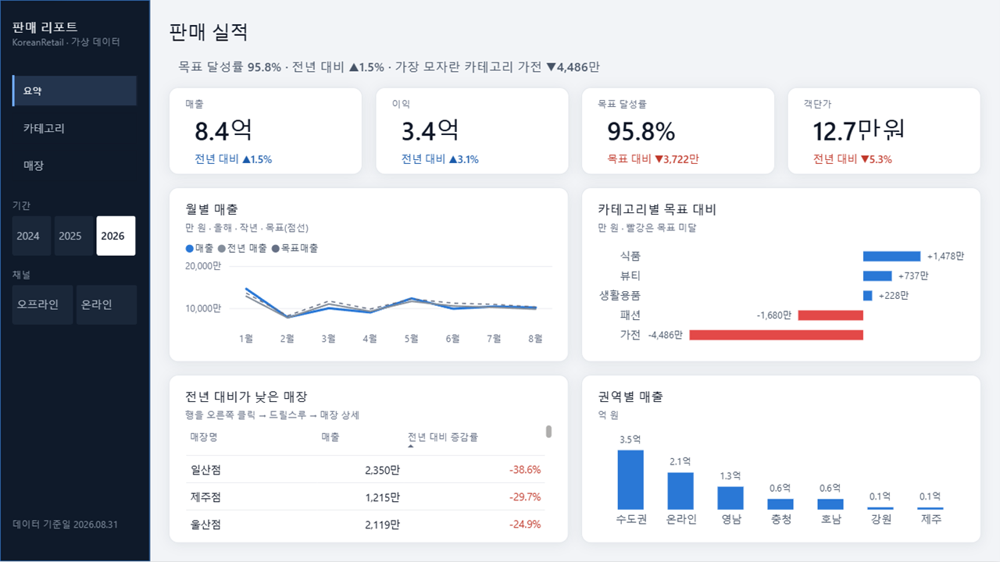
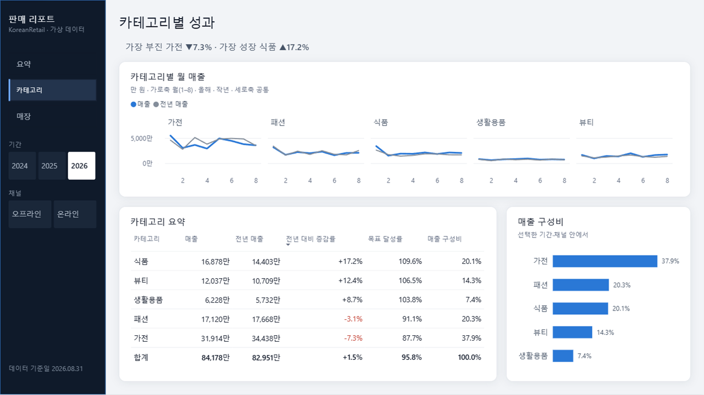
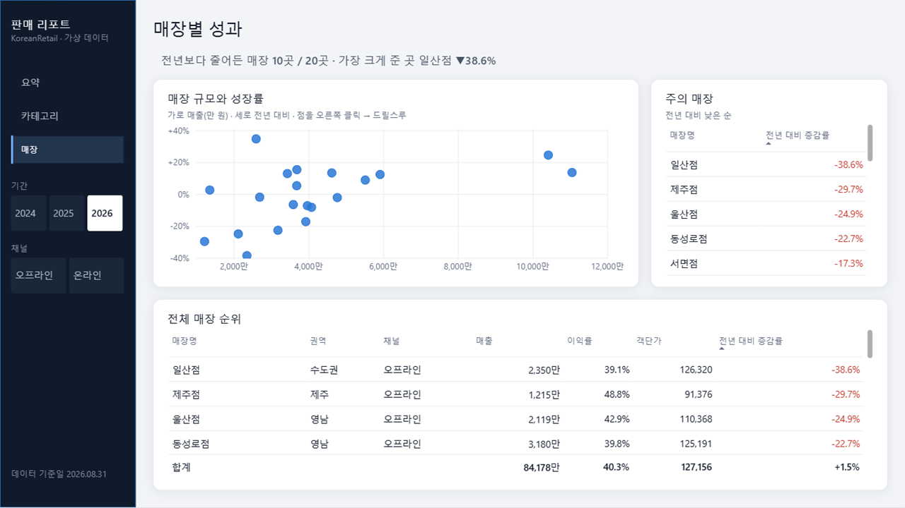
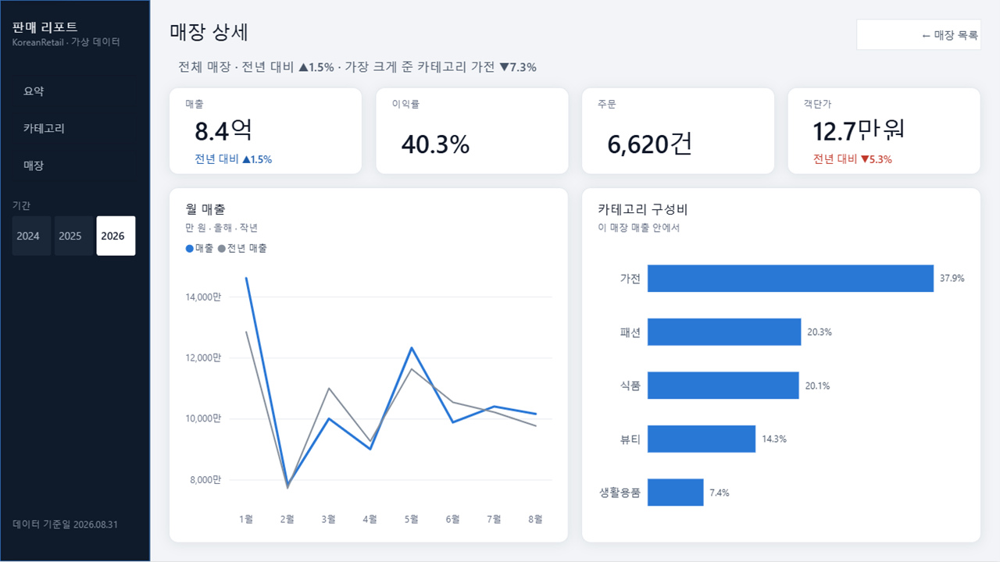

# powerbi-autopilot

요청 한 줄로 Power BI 리포트를 **데이터 모델 → 디자인 → 검증**까지 만드는 AI 에이전트 워크플로우.
목표는 두 가지다. **보기 좋은 리포트**, 그리고 **적은 토큰**.

> **TL;DR (EN)** — An AI-agent workflow that turns a one-line request into a Power BI report.
> I analyzed 1,800+ public Power BI reports to derive design rules and a 48-point review rubric, then built a
> theme-first generator: the agent writes a ~9 KB spec, and scripts produce a 4-page, 52-visual PBIP report that passes
> Microsoft's official validator with zero errors — rendered and checked in Power BI Desktop, not just in JSON.
> Korean retail sample data; every number is DAX-verified.



<sub>생성기가 만든 PBIP를 Power BI Desktop에서 연 화면. 서식은 전부 테마에서 오고, 제목 아래 문장은 필터에 따라 다시 계산되는 DAX 측정값이다.</sub>

---

## 왜 만들었나

이전 직장에서 기존 Power BI 리포트를 PBIP(텍스트 형식)로 바꿔 LLM에게 읽히고, 템플릿을 참고해 새 리포트를 만들게 하는 방식을 직접 설계해 팀에 배포했다.
리포트는 만들어졌다. 하지만 실무에서 계속 쓰기에는 두 가지가 걸렸다.

1. **토큰이 너무 많이 들었다.** 리포트 몇 개를 "학습"시키려면 매번 수십만 토큰을 읽어야 했다.
2. **결과물이 예쁘지 않았다.** 기존 리포트를 따라 하니 기존 리포트 수준의 디자인이 그대로 나왔다.

그래서 이 문제를 공개 데이터로 처음부터 다시 풀고 있다. 모든 과정은 [진행 기록](docs/progress-log.md)에 남긴다. 결정한 것, 틀린 가설, 실패까지 전부다.

## 지금까지 한 것

| 영역 | 결과 |
|---|---|
| 공개 리포트 분석 | GitHub 저장소 1,737곳을 훑어 **PBIX·PBIT 1,830개 + PBIP 폴더 271개** 분석 ([research](research/README.md)) |
| 서식 실태 조사 | `visual.json` 11,323개. **파일 용량의 67%가 서식이고, 대부분 테마가 아니라 비주얼마다 따로 박혀 있다** |
| 디자인 원칙 | 근거 자료 7종 + 수집 데이터 → [원칙 12개 절](design-system/principles.md) → [채점표 24항목·48점](design-system/review-rubric.md) |
| 데이터 모델 | Power BI Modeling MCP로 테이블 7 · 관계 6 · 측정값 29. **DAX 쿼리 결과가 Python 기대값과 전부 일치** ([예제 03](examples/03-modeling-mcp/model-doc.md)) |
| 디자인 시스템 | 토큰 파일 하나 → [Power BI 테마](design-system/themes/README.md)(공식 스키마 2.157 통과) + [레이아웃 템플릿](design-system/layouts/README.md)(좌표 전부 8의 배수, 겹침·경계선 자동 검사) |
| 생성기 | 에이전트는 [명세 9.4KB](examples/04-autopilot/report.spec.json)만 쓴다 → 4페이지 · 비주얼 52개 PBIP. **공식 검증(`powerbi-report-author validate`) 오류 0 · 경고 0** |
| 렌더링 검증 | 생성한 파일을 Desktop으로 열어 전 페이지를 캡처하는 루프. **검증기는 통과했지만 화면이 틀린 문제를 18개** 찾아 고쳤다 |

## 결과 화면 (Power BI Desktop)

| 카테고리 분석 | 매장 비교 |
|---|---|
|  |  |
| **매장 상세 (드릴스루 대상)** | **HTML 시안 v2 (비교용)** |
|  |  |

- **왼쪽 레일**에 리포트 이름, 페이지 선택기, 기간·채널 버튼, 기준일을 모았다. 본문은 분석에만 쓴다.
- **제목 아래 결론 한 줄**은 DAX가 쓴다. "가장 부진 가전 ▼7.3% · 가장 성장 식품 ▲17.2%"는 필터를 바꾸면 다시 쓰인다.
  한국어 조사(이/가)가 받침에 따라 달라서 "항목 + 숫자" 꼴로 문장을 짰다.
- **숫자는 억·만으로.** Power BI 자동 단위("40천만")를 끄고 측정값 서식이 단위를 붙인다. 증감은 ▲▼와 색을 함께 쓴다(한국 주식 화면에서는 빨강이 상승이라 색만으로는 헷갈린다).
- 숫자는 전부 DAX로 대조했다. 일산점 ▼38.6%, 가전 ▼7.3%, 온라인 ▲18.6%는 데이터를 만들 때 심어 둔 값 그대로다.

## 토큰을 어떻게 줄였나

| | 크기 | 토큰(대략) |
|---|---:|---:|
| 에이전트가 쓰는 명세 | 9.4KB | 3,200 |
| 생성기가 쓰는 리포트 JSON (테마 제외) | 165KB | 56,000 |

에이전트가 쓰는 양은 결과물의 **약 6%**다. 좌표는 레이아웃 템플릿이, 서식은 테마가, 필드 대조와 파일 구조는 스크립트가 맡는다.
명세에 없는 필드를 쓰면 스크립트가 TMDL과 대조해 Desktop을 열기 전에 멈춘다(토큰 0).
공개 PBIR의 `visual.json`이 평균 6.5KB인데, 이 생성기의 결과는 평균 3.1KB다. 서식을 테마로 뺀 만큼 가벼워졌다.

## 데이터에서 찾은 것

디자인 규칙은 감이 아니라 데이터에서 정했다.

- **좋은 리포트는 덜 채운다.** 전문가·공식 리포트는 포트폴리오 리포트보다 페이지당 비주얼이 적고(5.8개 대 10개) 간격이 넓었다(32px 대 18px).
- **페이지는 많은데 길 안내가 없다.** 여러 페이지 리포트가 65%인데, 그중 리포트 안에 이동 수단(페이지 선택기·버튼)을 둔 곳은 28%뿐이었다.
- **책갈피는 비싸다.** 책갈피 파일은 평균 15KB로 비주얼 파일의 두 배가 넘는다. 책갈피가 있는 리포트는 책갈피만 중앙값 약 2.2만 토큰이다.
  그래서 지표 전환은 필드 매개변수, 상세는 드릴스루, 이야기 순서는 페이지로 나눴다.
- **"예쁜" 포트폴리오의 상당수는 배경 이미지 위에 비주얼을 올린 것이다.** 예쁘지만 수정할 때마다 이미지를 다시 만들어야 해서, 자동화에는 테마와 도형이 맞다.

## 일하는 방식

AI 에이전트(Claude Code)가 파일을 만들고 고친다. 나는 문제를 정의하고, 설계를 정하고, 검증 기준을 세우고, 결과를 판단한다.
그 과정에서 지키는 규칙은 다섯 가지다.

1. **원본을 통째로 읽히지 않는다.** 1페이지 리포트 폴더 하나가 약 11만 토큰이다. 스크립트가 필요한 지표만 뽑고 에이전트는 요약만 본다.
2. **숫자는 눈이 아니라 쿼리로 확인한다.** 모델의 DAX 결과를 원천 데이터 계산과 대조한다.
3. **화면은 캡처로 확인한다.** 검증기를 통과한 파일에서도 전 기간 합계가 보이거나("35.8억"), 단위가 두 번 붙거나("40천만"), 버튼 글자가 사라졌다.
4. **속성 이름은 기억이 아니라 도구로 확인한다.** 공식 CLI와 공개 PBIR 수백 개에서 실제 저장 형식을 대조한다.
5. **실패도 기록한다.** 스캔 도구가 옵션 하나 때문에 몇 분 만에 5.8GB를 받아 버린 일까지 적어 두었다.

## 저장소 구성

```
powerbi-autopilot/
├── design-system/     디자인 원칙, 채점표, 토큰 → 테마, 레이아웃 템플릿, HTML 시안
├── examples/          공용 가상 데이터, 예제별 프롬프트·모델·명세·결과·캡처
├── research/          공개 리포트 수집·분석 스크립트와 결과 (원본은 재배포하지 않음)
├── tools/             생성기(명세 → PBIR), 테마·레이아웃 빌드, 토큰 측정
└── docs/              환경 세팅, 도구 비교 규칙, 진행 기록
```

## 직접 해 보기

```bash
python examples/_data/korean-retail/generate.py            # 가상 판매 데이터 생성 (시드 고정)
python tools/build_layouts.py && python tools/build_themes.py
python tools/generate_pbir.py examples/04-autopilot/report.spec.json
powerbi-report-author validate examples/04-autopilot/KoreanRetail.Report
# Desktop에서 열어 볼 사본: --local-data --out <작업 폴더> 를 붙이면 데이터 경로를 이 PC에 맞춘다
```

공개 리포트 분석을 재현하는 방법은 [research/README.md](research/README.md)에 있다.

## 다음 계획

- [x] 시안의 디자인 토큰을 Power BI 테마 JSON과 레이아웃 템플릿으로 옮기기
- [x] 명세 → PBIR 생성기, 공식 검증 통과, Desktop 렌더링 확인
- [ ] 표 안의 미니 추이선(SVG 측정값), 산점도 기준선과 이름표
- [ ] 어두운 테마로 같은 리포트 렌더링
- [ ] 같은 요청문으로 도구 3종 비교(Microsoft 공식 스킬 / 커뮤니티 스킬 / Modeling MCP), 토큰과 채점표 점수로

## 기술

Power BI (PBIP · PBIR · TMDL · DAX) · Python (생성기·분석 스크립트) · JavaScript/SVG (반응형 시안) ·
Claude Code + MCP (Power BI Modeling MCP) · Windows UI Automation (Desktop 캡처) · Git

---

만든 사람: [jinseong0407](https://github.com/jinseong0407) · 라이선스: [MIT](LICENSE)
