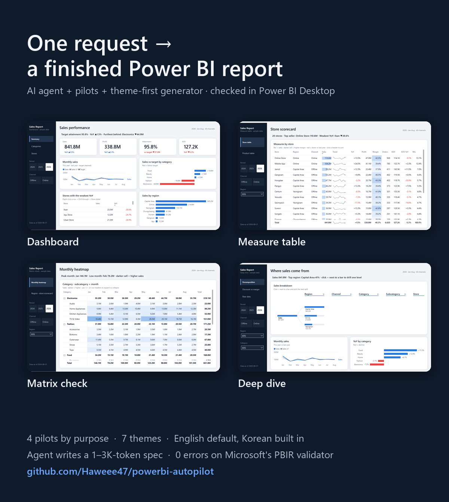

# powerbi-autopilot

**English** · [한국어](README.ko.md)

An AI-agent workflow that builds a Power BI report from start to finish (**data model → design → validation**) from a one-line request.
No manual clicks in Power BI Desktop. Two goals: **reports that look good**, and **low token cost**.



---

## Why I built this

At my previous job I designed and rolled out a workflow for my team: convert existing Power BI reports to PBIP (a text-based format), have an LLM read them, and generate new reports from templates.
It worked. But two things kept it from being practical day to day:

1. **It burned too many tokens.** Teaching it a few reference reports meant reading hundreds of thousands of tokens every time.
2. **The results didn't look good.** Copying existing reports reproduced their design, flaws included.

So I'm solving the same problem again from scratch, with public data. Every step is in the [progress log](docs/progress-log.md) (Korean): decisions, wrong hypotheses, and failures included.

## How it works

Ask for a new report and the agent asks only three things: **purpose, theme, language.**
It then copies a pre-built pilot, swaps in your fields and text, generates the PBIP, runs Microsoft's validator,
and opens the report in Power BI Desktop to screenshot every page ([skill](.claude/skills/new-report/SKILL.md)).

```bash
python tools/new_report.py --purpose table --theme paper --lang en --name StoreKPI   # copy a pilot (~1.6K-token spec)
python tools/generate_pbir.py examples/StoreKPI/report.spec.json                      # generate the PBIP
powerbi-report-author validate examples/StoreKPI/StoreKPI.Report                       # official validation
```

## Quick start

1. **Download**: green **Code** button → **Download ZIP** (or `git clone`). You need Windows, Power BI Desktop and Python 3.10+.
2. **Double-click `quickstart.cmd`**. It builds the dashboard pilot with bundled sample data and opens it in Power BI Desktop.
3. Click **Refresh now** on the yellow bar (and **Apply changes** if asked).

Step-by-step guide, including building reports by asking and using your own data:
[English](docs/guide/en.md) · [한국어](docs/guide/ko.md) · [日本語](docs/guide/ja.md) · [简体中文](docs/guide/zh-CN.md)

> Known issue: Power BI Desktop 2.157.1354.0 cuts off a few labels in the pilots. Details and status in the [changelog](CHANGELOG.md#known-issues).

## Four pilots by purpose

| Dashboard: executive summary | Measure table: measure input matrix |
|---|---|
|  |  |
| KPIs · trend · one-line takeaway → drillthrough detail | Rows = items, columns = measures. One word per column (`bar` · `heat` · `sign`) sets the conditional formatting |
| **Matrix check** | **Deep dive** |
|  |  |
| Hierarchical rows × month heatmap, region › store scorecard (opens expanded) | Decomposition tree · discount vs. margin scatter · source rows |

Full list and how to choose: [templates/catalog.json](templates/catalog.json)

## Three themes · languages


- **Themes**: Navy · Paper · Midnight. Generated from one token file; all three pass Power BI's official theme schema (2.157).
- **Languages**: English by default, Korean built in. UI text, field names, number units (M · K ↔ 만 · 억), takeaway sentences and even data values switch with the language.
  Add another language with one entry in [locales.json](design-system/i18n/locales.json) and one measures file.

## Data sources

The pilots run on a seeded synthetic retail dataset, so anyone can reproduce them exactly.
I haven't fully validated ODBC connections yet because of security constraints. If you already have a Power BI report on ODBC,
save it as PBIP first and let the agent learn its design and connection setup. The output will fit your environment much better.

## What's done so far

| Area | Result |
|---|---|
| Public report analysis | Scanned 1,737 GitHub repos and analyzed **1,830 PBIX/PBIT files + 271 PBIP folders** ([research](research/README.md)) |
| Formatting audit | 11,323 `visual.json` files. **67% of file size is formatting, and most of it is hard-coded per visual instead of living in the theme** |
| Design basis | Collected data + 11 research papers ([literature.md](design-system/literature.md)) → [principles](design-system/principles.md) → [review rubric](design-system/review-rubric.md) |
| Data model | Built with Power BI Modeling MCP: 7 tables · 6 relationships · 29 measures. **Every DAX query result matched the Python expected values** ([example 03](examples/03-modeling-mcp/model-doc.md)) |
| Generator | Spec → PBIP. All four pilots and the Korean example pass Microsoft's validator (`powerbi-report-author validate`) with **0 errors · 0 warnings** |
| Render check | A loop that opens each generated file in Desktop and captures every page. It caught and fixed **25+ issues** that passed the validator but looked wrong on screen |

## How tokens were cut

| Pilot | Spec the agent writes | Generated report JSON |
|---|---:|---:|
| Matrix check | 1.3K tokens | 22K tokens |
| Measure table | 1.9K | 25K |
| Deep dive | 2.0K | 38K |
| Dashboard | 3.5K | 57K |

Layout templates handle coordinates, the theme handles formatting, shared measure files handle units and sentences, and scripts handle field checks and file structure.
A new report keeps only one language when it copies a pilot, so its spec is even smaller. Fields missing from the model are caught against the TMDL before Desktop ever opens (0 tokens).

## Design basis

Decided from data and research, not gut feel. A few examples:

- **Say the takeaway in words, and emphasize the same thing in the chart.** What the text and the chart both point to is what people remember (Kim et al., CHI 2021).
  Every page has a one-line takeaway written by DAX, and that item shows up again in the chart in red, at the top.
- **Always show what you're looking at.** Next to the title: "2026 · Jan–Aug · All channels" (metadata pattern, Bach et al., IEEE TVCG 2023).
- **Order matters as much as restraint.** Putting the key chart center-left keeps eye movement shortest (eye-tracking study, Sensors 2024).
- **Good reports fill less.** Expert and official reports had fewer visuals per page than portfolio reports (5.8 vs. 10) and wider spacing (32px vs. 18px, collected data).
- **Numbers: 3–4 digits plus a unit.** "841.8M", "8.4억" (Microsoft guidance).

## How I work

An AI agent (Claude Code) creates and edits the files. I define the problem, set the design, decide what counts as correct, and judge the results.

1. **Never feed raw files whole.** Scripts extract what's needed; the agent only sees summaries.
2. **Verify numbers with queries.** Even the takeaway sentences are checked against DAX.
3. **Verify the screen with captures.** Files that passed the validator still showed all-time totals, doubled units ("40천만"), or broken English numbers ("110,558,285.0,,M").
4. **Check property names with tools, not memory.** I compared against the official CLI and hundreds of public PBIR files to see how settings are actually stored.
5. **Log the failures too.**

## Repository layout

```
powerbi-autopilot/
├── templates/         Four pilots by purpose, shared measures (per language), glossary, pilot catalog
├── design-system/     Principles, rubric, research notes, tokens → three themes, layout templates, locales, HTML prototypes
├── tools/             Generator (spec → PBIR), new-report starter, theme/layout builds, share images, token measurement
├── examples/          Shared synthetic data (Korean/English), example 03 (Modeling MCP), example 04 (first generator run)
├── research/          Public report collection and analysis scripts with results (originals are not redistributed)
├── docs/              Setup, progress log, share drafts
└── .claude/skills/    new-report: the agent procedure that asks purpose, theme, language and starts from a pilot
```

## Try it

```bash
python examples/_data/korean-retail/generate.py              # synthetic sales data (fixed seed)
python examples/_data/korean-retail/generate.py --lang en    # same data, English values
python tools/build_layouts.py && python tools/build_themes.py
python tools/generate_pbir.py templates/dashboard/pilot.spec.json               # English · Navy
python tools/generate_pbir.py templates/dashboard/pilot.spec.json --lang ko --theme midnight --out <folder>
```

## Feedback

I read, log and answer every issue. Design feedback comes with a 1–5 rating and is mapped to the review rubric;
when several people point at the same thing, the design rule changes. [How feedback becomes changes](CONTRIBUTING.md#how-feedback-becomes-changes)

[Something looks wrong](https://github.com/Haweee47/powerbi-autopilot/issues/new?template=1-render-bug.yml) ·
[Design feedback](https://github.com/Haweee47/powerbi-autopilot/issues/new?template=2-design-feedback.yml) ·
[New pilot or feature](https://github.com/Haweee47/powerbi-autopilot/issues/new?template=3-pilot-request.yml) ·
[Language support](https://github.com/Haweee47/powerbi-autopilot/issues/new?template=4-language-request.yml) ·
[Discussions](https://github.com/Haweee47/powerbi-autopilot/discussions). Any language is fine. What changed: [CHANGELOG](CHANGELOG.md).

## Roadmap

This is a work in progress. I'll keep improving it and logging what I learn.

- [x] Design tokens → themes, layout templates, spec → PBIR generator
- [x] Four pilots · three themes · multiple languages
- [ ] Sparklines inside tables (SVG measures)
- [ ] Real-data flow: Presto/Redshift query → model → pilot, including ODBC validation
- [ ] Same request across three tools (Microsoft's official skill / a community skill / Modeling MCP), compared by tokens and rubric score

## Tech

Power BI (PBIP · PBIR · TMDL · DAX) · Python (generator, analysis scripts) · JavaScript/SVG (responsive prototypes) ·
Claude Code + MCP (Power BI Modeling MCP) · Windows UI Automation (Desktop captures) · Git

---

Built by [Haweee47](https://github.com/Haweee47) · License: [MIT](LICENSE)
