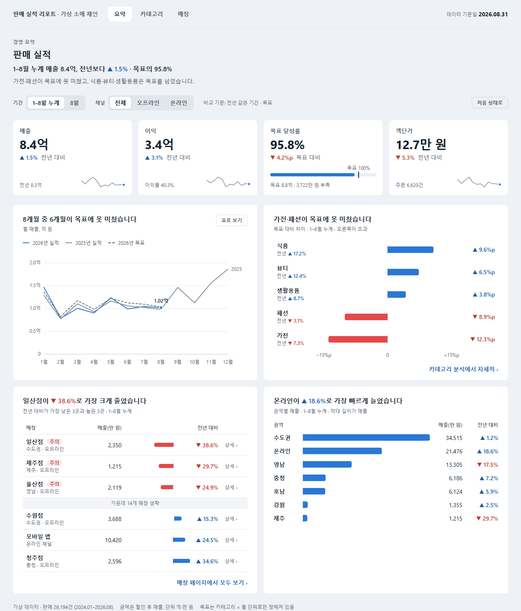
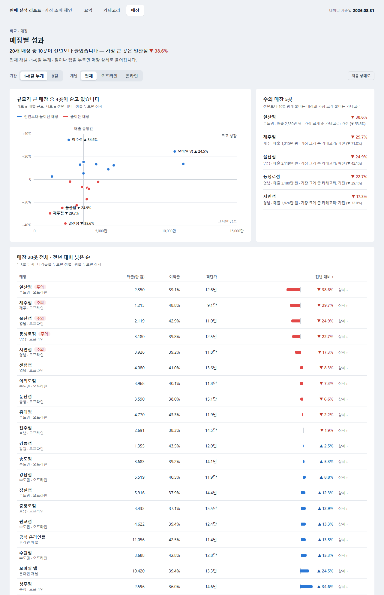
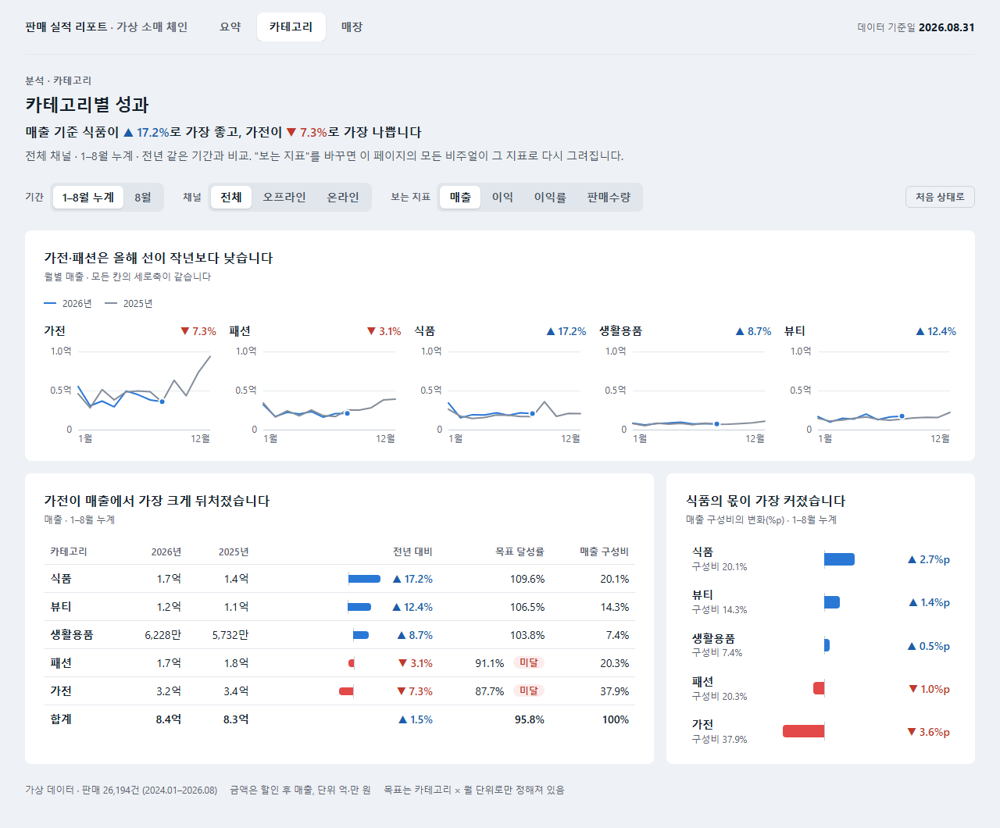
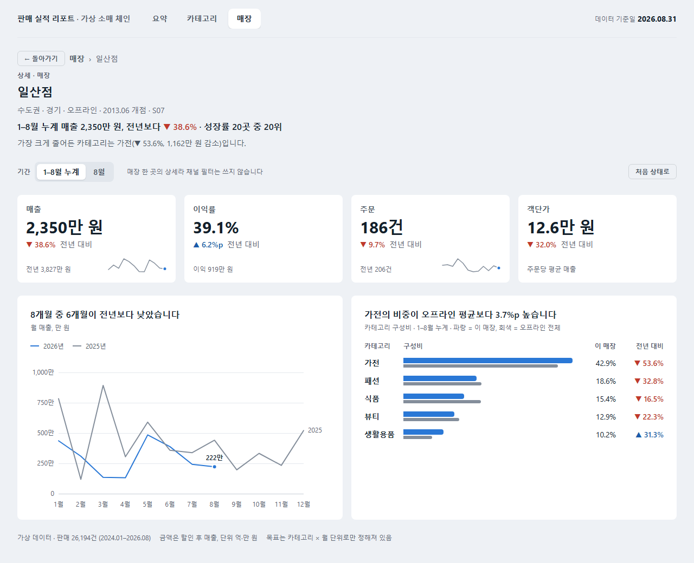
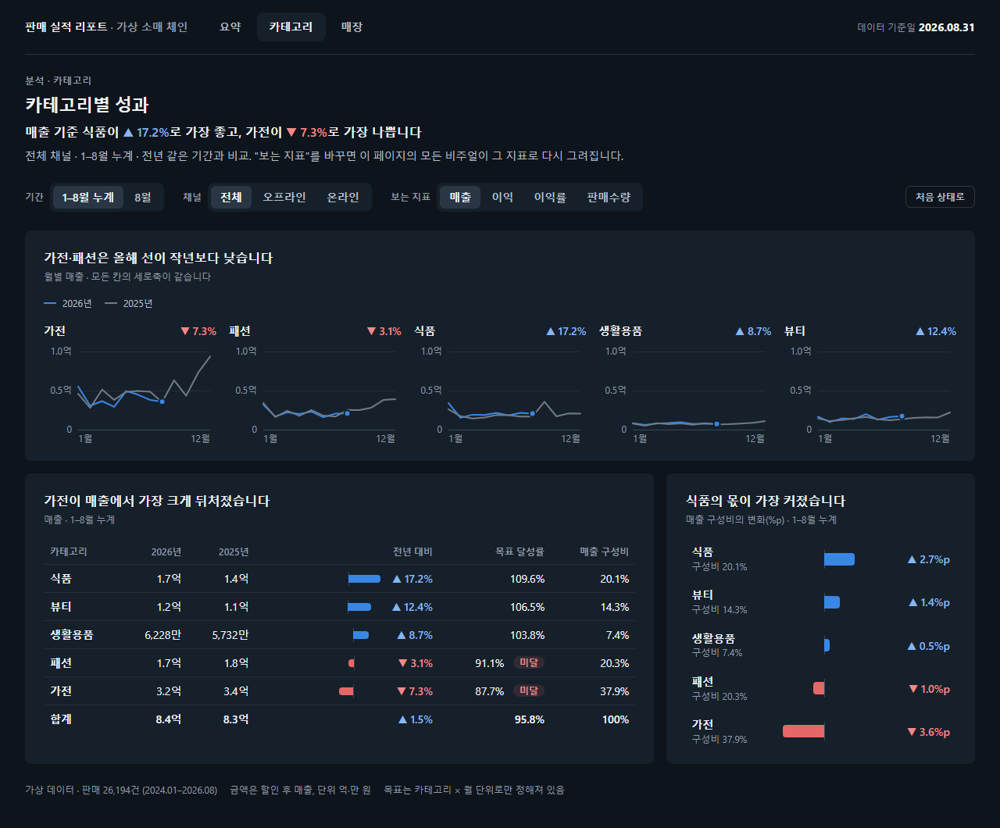

# powerbi-autopilot

요청 한 줄로 Power BI 리포트를 **데이터 모델 → 디자인 → 검증**까지 만드는 AI 에이전트 워크플로우.
목표는 두 가지다. **보기 좋은 리포트**, 그리고 **적은 토큰**.

> **TL;DR (EN)** — An AI-agent workflow that turns a one-line request into a Power BI report.
> I analyzed 1,800+ public Power BI reports to derive design rules, turned them into a 48-point review
> rubric and a multi-page responsive prototype, and I'm building a theme-first generator to cut LLM token
> cost. Korean retail sample data; every number is DAX-verified.



---

## 왜 만들었나

이전 직장에서 기존 Power BI 리포트를 PBIP(텍스트 형식)로 바꿔 LLM에게 읽히고, 템플릿을 참고해 새 리포트를 만들게 하는 방식을 직접 설계해 팀에 배포했다.
리포트는 만들어졌다. 하지만 실무에서 계속 쓰기에는 두 가지가 걸렸다.

1. **토큰이 너무 많이 들었다.** 리포트 몇 개를 "학습"시키려면 매번 수십만 토큰을 읽어야 했다.
2. **결과물이 예쁘지 않았다.** 기존 리포트를 따라 하니 기존 리포트 수준의 디자인이 그대로 나왔다.

그래서 이 문제를 공개 데이터로 처음부터 다시 풀고 있다. 모든 과정은 [진행 기록](docs/progress-log.md)에 남긴다. 결정한 것, 틀린 가설, 실패까지 전부다.

## 지금까지 한 것

| 영역 | 결과 |
|---|---|
| 공개 리포트 분석 | GitHub 저장소 1,737곳을 훑어 **PBIX·PBIT 1,830개 + PBIP 폴더 271개** 분석 ([research](research/README.md)) |
| 서식 실태 조사 | `visual.json` 11,323개. **파일 용량의 67%가 서식이고, 대부분 테마가 아니라 비주얼마다 따로 박혀 있다** |
| 디자인 원칙 | 근거 자료 7종 + 수집 데이터 → [원칙 12개 절](design-system/principles.md) → [채점표 24항목·48점](design-system/review-rubric.md) |
| 데이터 모델 | Power BI Modeling MCP로 테이블 7 · 관계 6 · 측정값 29. **DAX 쿼리 결과가 Python 기대값과 전부 일치** ([예제 03](examples/03-modeling-mcp/model-doc.md)) |
| 시안 | 1페이지 v1(자가 채점 37/40) → **4페이지 v2**. 페이지 선택기, 드릴스루, 지표 전환, 반응형, 다크 모드 ([prototypes](design-system/prototypes/README.md)) |

## 결과 화면

| 매장 비교 → 매장 상세 (드릴스루) | 카테고리 분석 (지표 전환) |
|---|---|
|  |  |
|  |  |

모든 제목과 헤더 문장은 데이터에서 계산된다.
예를 들어 "일산점이 ▼38.6%로 가장 크게 줄었습니다", "가장 크게 줄어든 카테고리는 가전(▼53.6%)"은 필터를 바꾸면 다시 쓰인다.
숫자는 예제 03의 DAX 검증값과 같다.

## 데이터에서 찾은 것

디자인 규칙은 감이 아니라 데이터에서 정했다.

- **좋은 리포트는 덜 채운다.** 전문가·공식 리포트는 포트폴리오 리포트보다 페이지당 비주얼이 적고(5.8개 대 10개) 간격이 넓었다(32px 대 18px).
- **페이지는 많은데 길 안내가 없다.** 여러 페이지 리포트가 65%인데, 그중 리포트 안에 이동 수단(페이지 선택기·버튼)을 둔 곳은 28%뿐이었다.
- **책갈피는 비싸다.** 책갈피 파일은 평균 15KB로 비주얼 파일의 두 배가 넘는다. 책갈피가 있는 리포트는 책갈피만 중앙값 약 2.2만 토큰이다.
  그래서 지표 전환은 필드 매개변수, 상세는 드릴스루, 이야기 순서는 페이지로 나눴다.
- **"예쁜" 포트폴리오의 상당수는 배경 이미지 위에 비주얼을 올린 것이다.** 예쁘지만 수정할 때마다 이미지를 다시 만들어야 해서, 자동화에는 테마와 도형이 맞다.

## 일하는 방식

AI 에이전트(Claude Code)가 파일을 만들고 고친다. 나는 문제를 정의하고, 설계를 정하고, 검증 기준을 세우고, 결과를 판단한다.
그 과정에서 지키는 규칙은 네 가지다.

1. **원본을 통째로 읽히지 않는다.** 1페이지 리포트 폴더 하나가 약 11만 토큰이다. 스크립트가 필요한 지표만 뽑고 에이전트는 요약만 본다.
2. **숫자는 눈이 아니라 쿼리로 확인한다.** 모델의 DAX 결과를 원천 데이터 계산과 대조한다.
3. **디자인은 채점표로 판단한다.** 캡처 → 채점 → 수정. 내가 만든 규칙을 내가 어긴 곳(v1의 감점 3개)도 이렇게 찾았다.
4. **실패도 기록한다.** 스캔 도구가 옵션 하나 때문에 몇 분 만에 5.8GB를 받아 버린 일까지 적어 두었다.

## 저장소 구성

```
powerbi-autopilot/
├── design-system/     디자인 원칙, 채점표, HTML 시안과 캡처
├── research/          공개 리포트 수집·분석 스크립트와 결과 (원본은 재배포하지 않음)
├── examples/          공용 가상 데이터, 예제별 프롬프트·모델·결과
├── docs/              환경 세팅, 도구 비교 규칙, 진행 기록
└── tools/             토큰 사용량 측정 스크립트
```

## 직접 해 보기

```bash
python examples/_data/korean-retail/generate.py      # 가상 판매 데이터 생성 (시드 고정)
# design-system/prototypes/sales-report.html 을 브라우저로 열기
```

공개 리포트 분석을 재현하는 방법은 [research/README.md](research/README.md)에 있다.

## 다음 계획

- [ ] 시안의 디자인 토큰을 **Power BI 테마 JSON**과 페이지 유형별 **레이아웃 템플릿**으로 옮기기
- [ ] **명세 → PBIR 생성기**: 서식은 테마에, `visual.json`에는 위치와 필드만. 생성 전후 토큰 비교
- [ ] 같은 요청문으로 도구 3종 비교(Microsoft 공식 스킬 / 커뮤니티 스킬 / Modeling MCP), 토큰과 채점표 점수로

## 기술

Power BI (PBIP · PBIR · TMDL · DAX) · Python (분석·집계 스크립트) · JavaScript/SVG (반응형 시안) ·
Claude Code + MCP (Power BI Modeling MCP) · Git

---

만든 사람: [jinseong0407](https://github.com/jinseong0407) · 라이선스: [MIT](LICENSE)
