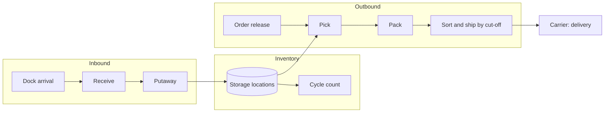

# Fulfillment center operations: concepts and report design

The pilots started with retail sales. Analysts in logistics read a different kind of report: how much went out, how fast,
at what labor cost, and why a shift fell behind. This note collects the public concepts behind the
[fulfillment pilot](../../templates/fulfillment/) and explains how they became pages. Every name and number in the pilot
is synthetic ([sample data](../../examples/_data/fulfillment/README.md)).

## What a fulfillment center does

Priorities used for page order: **outbound first** (customer promises and most of the labor), **inbound and inventory
second** (they feed outbound; late putaway becomes a stock-out), **delivery third** (mostly the carrier's work).
**Productivity** runs through all of them.

## Productivity: one number and what moves it

UPH, units per hour (some teams call it HTP, handling time productivity), is the headline. The pilot defines it on
**paid** hours, so waiting and support work count against it, and splits the gap to the engineered standard into causes.

| Measure | Formula | Reads as |
|---|---|---|
| UPH | handled units / paid hours | output per hour the site paid for |
| Paid hours | direct + indirect + idle | all hours on the clock |
| % of standard | standard hours / direct hours | how fast the work was done when people were working (standard hours = units / standard UPH) |
| Target UPH | units / standard hours × 85% | the plan: standard rate at the planned direct share |
| Hours lost | paid hours − standard hours | hours the standard did not need |
| … split by cause | (direct − standard) + indirect + idle | slow work · support work · waiting |

"Handled units" counts each flow's volume once: pick units for outbound, receive units for inbound, counted units for
inventory. For a single process (a pack team) it is that process's units.

The inputs an analyst checks when UPH drops, and where the pilot shows them:

| Input | Why it moves UPH | Page |
|---|---|---|
| Idle time (volume below staffing, system downtime) | paid hours with nothing to do | Lost hours |
| Indirect work (training, meetings, cleaning) | paid hours not on units | Lost hours, Team detail |
| Zone / item size | bulky items mean more travel and handling | Lost hours (tree), By hour, Teams |
| Shift and hour of day | start-up hour, late-night fatigue | By hour, Team detail |
| Tenure (share of hours by people in their first 30 days) | learning curve | Teams (scatter) |
| Order type and profile (single-unit, multi-unit, bulk; units per order) | a single-unit order walks a full pick path for one unit | Outbound, Travel |
| Travel per unit (DPU, metres walked per unit handled) | the biggest pick driver after the standard itself: zone layout, slotting, order mix | Travel, Teams |
| Backlog and overtime | late cut-offs, longer cycle times | Outbound |

## Other measures

The operational list follows WERC's DC Measures survey (customer, inbound, outbound, inventory, capacity, quality, labor).

| Area | Measure | Formula |
|---|---|---|
| Productivity | DPU (distance per unit) | metres walked / units handled by the work that walks (picking, putaway, counting) |
| | Single-unit share | orders with one unit / orders shipped |
| Outbound | On-time ship | orders shipped by cut-off / orders due (including carried backlog) |
| | Missed cut-off | orders due − orders shipped on time |
| | Order cycle hours | hours from order release to ship, per order |
| | Pick accuracy | 1 − orders with a pick error / orders shipped |
| Inbound | Dock-to-stock hours | hours from arrival to putaway, per delivery |
| | On-time receipts · damage-free · documents correct | share of deliveries |
| Inventory | Inventory accuracy | counted locations that matched / locations counted |
| | Capacity used | occupied locations / all locations (day-weighted) |
| Delivery | On-time delivery · first-attempt | share of orders shipped |

## How it became pages

The pilot reuses the layout templates of the retail pilots; only the model, measures and sentences are new.

| Page (layout) | Question it answers | Main visuals |
|---|---|---|
| Outbound (summary) | Are we shipping on time, at plan speed? | units shipped, outbound UPH vs plan, on-time ship, missed cut-offs; UPH by day with the plan; pick/pack/ship vs standard; three weakest teams; first delivery attempt by carrier |
| Lost hours (tree) | Where do the paid hours go? | hours lost split by flow → process → shift → zone → team; % of standard by week; lost hours by cause |
| By hour (matrix) | When does the work slow down? | process × hour heatmap of % of standard |
| Teams (scatter + tables) | Which teams are behind, and is it new hires? | new-hire share vs % of standard; five weakest; every team with a weekly UPH sparkline, DPU, idle and new-hire share |
| Travel (scatter) | Why do we walk this far per unit? | one dot per day: share of single-unit orders vs metres walked per picked unit; metres per unit by zone; filter by order type |
| Inbound and inventory (summary) | Is stock getting to the shelf and staying accurate? | units received, inbound UPH, dock-to-stock, inventory accuracy; dock-to-stock by arrival time; suppliers with the most damage; accuracy by zone |
| Team detail (drill-through) | What happened in this team? | UPH vs plan, % of standard, idle and indirect share, crew; UPH by week; % of standard by hour |

Design choices specific to operations:
- **Gaps, not levels.** Bars show "vs standard" and "vs target" (diverging, red below) because 91% and 97% bars look the same.
- **One headline per page names the worst item** (team, hour, zone, supplier), the one a shift lead acts on first.
- **Plans are dashed lines** on every trend (target UPH, 4-hour dock-to-stock, 100% of standard).
- **Shift is a page-wide filter**, quarter the period filter; zones and processes are dropdowns where they matter.

## Using it with your own warehouse data

Map your tables to the measures above with `new_report.py --purpose fulfillment --model <your TMDL>`
([model map](../../examples/05-own-model/README.md)). Things that differ between sites:
- **Standards**: engineered standards per process (and sometimes per item size or zone); the pilot has one per process.
- **Paid vs direct hours**: the pilot computes UPH on paid hours (waiting and support work count against it). Sites that measure on
  direct hours only can use `Direct UPH` and keep the lost-hours split.
- **Travel**: DPU needs distance per task from the WMS or the pick-path calculation. Without it, keep the order mix and zone as the
  proxies for travel.
- **Night shift dates**: the pilot dates a night shift by its start; sites that split at midnight need the same rule in the model.
- **Volume**: count each flow once (pick or ship, not both).

## Sources

- WERC, [DC Measures Survey 2025](https://wercmetrics.werc.org/WERC-DC-Measures-Survey-2025.pdf) (the metric list) and the
  [top 12 DC metrics](https://www.yale.com/globalassets/coms/yale/north-america/documents/white-papers/snack-drawer/YALE-1520_WERC-DC-Metrics-infographic.pdf)
- Honeywell, [Which metrics matter most to DC operations](https://www.honeywell.com/us/en/news/featured-stories/2020/02/which-metrics-matter-most-to-dc-operations)
- Takt, [Direct vs. indirect labor in warehouses](https://www.takt.io/guides/direct-vs-indirect-labor-warehouse);
  Argos Software, [Calculating labor utilization](https://www.argosoftware.com/blog/calculating-labor-utilization/)
- JIT Transportation, [Warehouse labor performance metrics](https://www.jittransportation.com/posts/ultimate-guide-to-warehouse-labor-performance-metrics)
