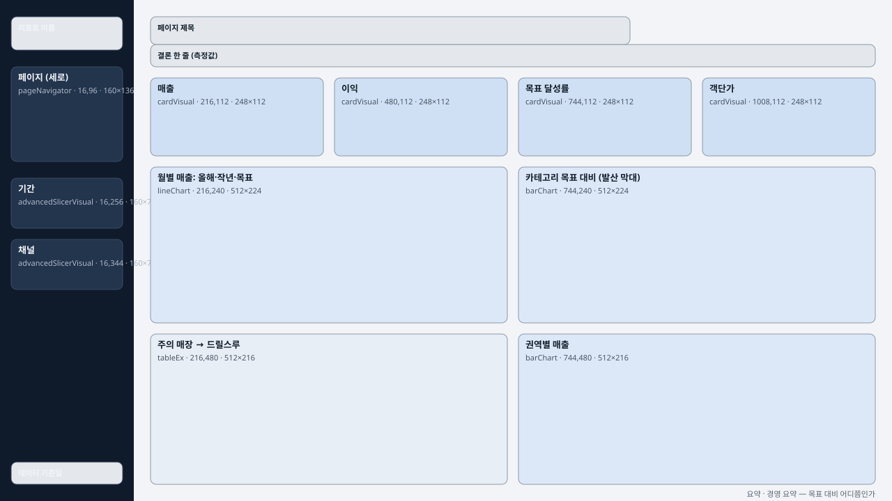
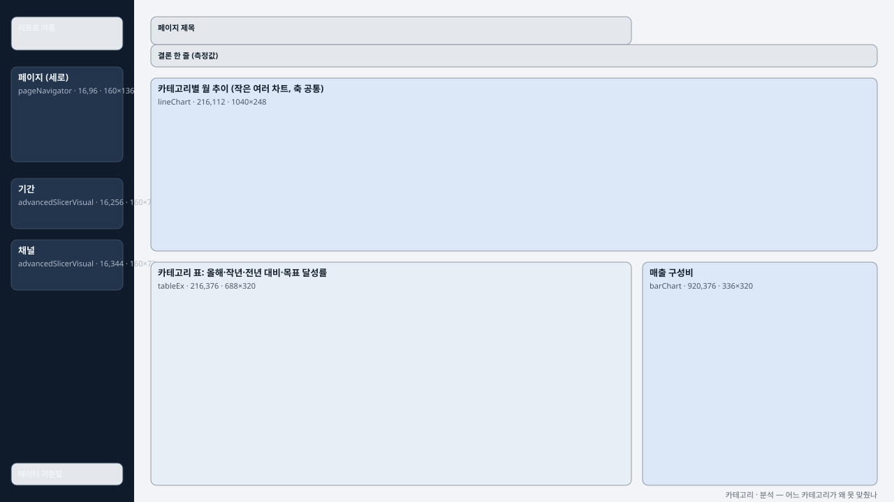
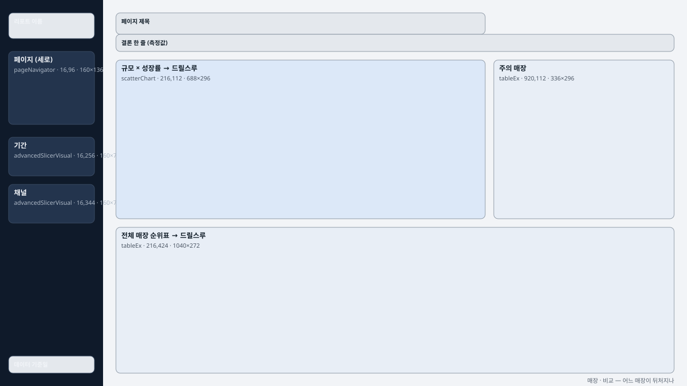
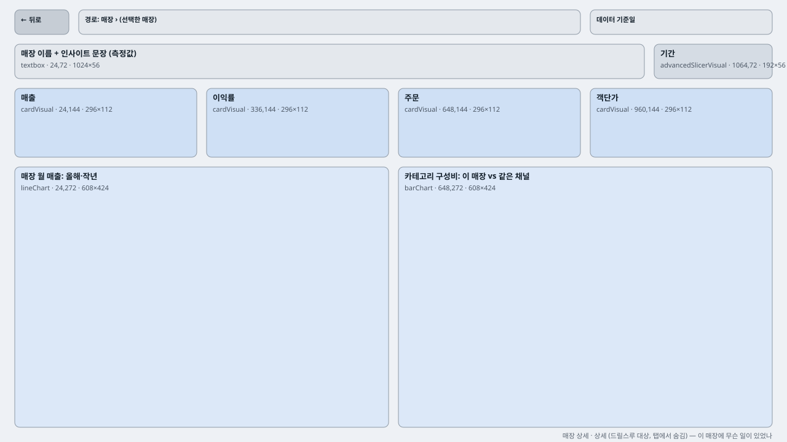

# 페이지 레이아웃 템플릿 (v3 · 앱형)

HTML 시안은 스크롤되지만 **Power BI 페이지는 1280×720 한 화면**이다.
그래서 페이지 유형마다 **고정 캔버스에 맞춘 좌표 틀**을 만들고, 생성기가 이 좌표만 쓰게 했다.

v2까지는 위쪽에 페이지 선택기 띠를 둔 구성이었다. Desktop에서 실제로 열어 보니 흰 카드가 격자로 늘어선
"기본 템플릿" 느낌이 강했다. v3는 **왼쪽 어두운 내비 레일 + 오른쪽 본문**의 앱형 구성으로 바꿨다.
이동과 필터는 레일에 모으고, 본문 위쪽은 제목과 **데이터로 계산한 결론 한 줄**에 쓴다.

## 격자

| 항목 | 값 | 이유 |
|---|---|---|
| 캔버스 | 1280 × 720 | 수집한 리포트의 85%가 이 크기 |
| 레일 | x 0~192, 안쪽 여백 16 | 리포트 이름 · 페이지 선택기(세로) · 기간 · 채널 · 기준일 |
| 본문 | x 216~1256, 12열 × **72px**, 간격 16 | 본문 폭 1,040에서 12열이 정확히 나뉜다. 모든 좌표가 정수이자 8의 배수 |
| 가로 띠 | 제목 24~64 · 결론 64~96 · 본문 112~696 | 모든 페이지에서 제목과 결론 문장이 같은 자리에 온다 |

좌표는 `열(col) · 폭(span)`으로 적는다. 픽셀은 스크립트가 계산한다.
사람도 AI도 "3열짜리 카드 4개"처럼 생각하고, 좌표 계산은 하지 않는다.

```
x = 216 + (col − 1) × (72 + 16)
w = span × 72 + (span − 1) × 16
```

레일 요소(`shared`)는 한 번만 적고 모든 페이지에 들어간다. 페이지는 `omit`으로 뺄 수 있다
(매장 상세는 한 매장만 보므로 채널 슬라이서를 뺀다). 명세에서도 레일 내용은 한 번만 적는다.

## 페이지 유형 4가지

| 요약 (경영 요약) | 카테고리 (분석) |
|---|---|
|  |  |
| **매장 (비교)** | **매장 상세 (드릴스루 대상)** |
|  |  |

- **요약**: KPI 4개(3열씩)와 본문 두 줄(6+6). 6열 경계가 KPI 줄부터 맨 아래까지 한 선으로 이어진다.
- **카테고리**: 작은 여러 차트(1행 × 5열, 세로축 공통)가 12열을 채우고, 아래 줄은 표(8) + 구성비(4).
- **매장**: 산점도(8) + 주의 목록(4). 아래 순위표(12)는 스크롤되는 표로 둔다. 20행을 한 화면에 다 넣지 않는다.
- **매장 상세**: 제목 오른쪽에 뒤로 가기. 페이지 선택기에서는 이 페이지를 숨긴다.

## 자동 검사

[`tools/build_layouts.py`](../../tools/build_layouts.py)가 좌표를 풀면서 네 가지를 검사한다. 하나라도 걸리면 실패로 끝난다.

1. 모든 x · y · 폭 · 높이가 8의 배수인가
2. 캔버스 밖으로 나간 영역이 없는가
3. 영역끼리 겹치지 않는가 (레일 바탕처럼 `layer: background`인 것은 제외)
4. 본문의 줄들이 세로 경계선을 공유하는가 (채점표 B4)

```bash
python tools/build_layouts.py
# [summary] 영역 16개 · 통과 … 열 폭 72px · 문제 0건
```

결과물 `layouts.resolved.json`은 PBIR 생성기가 읽는 좌표 파일이다.
