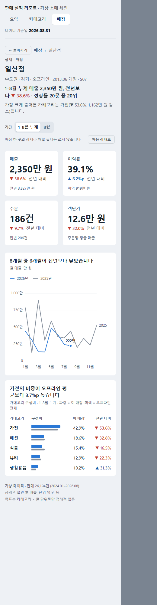

# 대시보드 시안 (HTML)

Power BI로 만들기 전에 [디자인 원칙](../principles.md)을 HTML로 먼저 적용해 보는 시안이다.
브라우저에서 바로 열린다. 폭에 따라 12열 → 2열 → 1열로 바뀌고, 밝은 테마와 어두운 테마를 모두 지원한다.

| 버전 | 파일 | 내용 |
|---|---|---|
| **v2 (현재)** | `sales-report.html` | 4페이지 리포트. 페이지 선택기, 드릴스루, 지표 전환, 툴팁 페이지 방식 |
| v1 | `sales-executive-summary.html` | 1페이지 경영 요약. 자가 채점 37/40 |

두 파일 모두 원본(`*.src.html`)의 `__DATA__` 자리에 `retail-data.json`을 넣어 만든다.
`retail-data.json`은 [공용 데이터](../../examples/_data/korean-retail/README.md)를 월·카테고리·매장 단위로 집계한 파일(52KB)이다.

```bash
python -c "src=open('sales-report.src.html',encoding='utf-8').read(); data=open('retail-data.json',encoding='utf-8').read().strip(); open('sales-report.html','w',encoding='utf-8').write(src.replace('__DATA__',data))"
```

숫자는 예제 03 모델의 DAX 검증값과 같다.
- 2026년 1~8월 매출 841,775,565원, 전년 829,505,235원
- 목표 879,000,000원

## v2 — 여러 페이지 리포트

| 페이지 | 유형 | 답하는 질문 | Power BI에서는 |
|---|---|---|---|
| 요약 | 경영 요약 | 목표 대비 어디쯤인가 | 첫 페이지 |
| 카테고리 | 분석 | 어느 카테고리가 왜 못 맞췄나 | **필드 매개변수**로 "보는 지표"(매출·이익·이익률·수량) 전환 |
| 매장 | 비교 | 어느 매장이 뒤처지나 | 산점도·순위표에서 **드릴스루** |
| 매장 상세 | 상세 | 이 매장에 무슨 일이 있었나 | **드릴스루 대상 페이지**. 탭에서는 숨기고 뒤로 가기·경로 표시 |

이동 설계를 Power BI 기능에 대응시키면 이렇다 ([원칙 9절](../principles.md)).

- **페이지 선택기**: 상단 탭. 모든 페이지 같은 자리에 두고, 매장 상세에 있을 때도 "매장"을 표시한다.
- **슬라이서 동기화**: 기간·채널 필터는 페이지를 옮겨도 유지된다.
- **초기화 책갈피**: "처음 상태로" 버튼. 기본 상태일 때는 비활성화된다.
- **보기 전환 책갈피**: 요약 추이 카드의 "표로 보기". 같은 자리에서 차트와 표를 바꾼다.
- **툴팁 페이지**: 카테고리 행·표 행·산점도 점에 마우스를 올리면 월별 흐름 미니 차트가 뜬다.
- **드릴스루**: 매장 표의 행이나 산점도의 점을 누르면 그 매장의 상세 페이지로 간다.
  주의 매장 목록에는 매장마다 "가장 크게 줄어든 카테고리"를 계산해 붙였다.
- **목표가 없는 수준**: 채널을 고르면 목표 달성률을 숨기고 전년 대비로 바꾼다. 매장 상세에서는 채널 필터 자체를 쓰지 않는다고 적어 둔다.

v1 자가 채점에서 나온 감점 3개를 고쳤다.
- 세로 경계선: 모든 페이지에서 6열 또는 8열 경계가 줄마다 이어진다.
- 글자 크기: 5단계(12 · 14 · 16 · 22 · 30)만 쓴다.
- 안쪽 여백: 8의 배수(16 · 24)로 맞췄다.

| 매장 비교 | 매장 상세 (휴대폰 폭) |
|---|---|
|  |  |

## v1 — 1페이지 경영 요약

| 원칙 (principles.md) | 시안에서 |
|---|---|
| 한 페이지 질문 하나, 제목은 인사이트 문장 | 헤더 문장과 카드 제목이 필터에 따라 다시 쓰인다 |
| 요약 → 맥락 → 상세 | KPI 4개 → 월별 추이·카테고리 → 권역·매장 |
| 모든 숫자에 비교 기준 | KPI마다 전년 대비·목표 대비, 12개월 추이선 |
| 강조색 하나 + 회색 | 올해 파랑, 작년 회색, 목표 점선 |
| 색만으로 뜻을 전하지 않음 | 모든 증감에 ▲▼와 부호. 색 조합은 색각이상 검증 스크립트 통과 |
| 한국어 표기 | 억·만 단위, %p, 받침에 맞춘 조사(이/가, 은/는) 자동 처리 |

## Power BI로 옮길 때

- 캔버스는 1280×720이다. HTML의 12열 폭을 8px 배수 좌표로 바꾼다 (바깥 여백 32, 간격 16).
- CSS 토큰은 테마 JSON으로 옮긴다.
  - `--page` → `background`
  - `--surface` → 비주얼 배경
  - `--accent` → `dataColors[0]`
  - `--pos` / `--neg` → `good` / `bad`
  - 글자 단계 → `textClasses`
- 글꼴: Windows에서는 Segoe UI에 한글 글자가 없어 맑은 고딕으로 대체된다. Power BI Desktop과 같은 조건이다.
- **휴대폰 화면은 Power BI가 자동으로 만들어 주지 않는다.** HTML의 1열 배치 순서대로 휴대폰 화면을 따로 배치한다.
