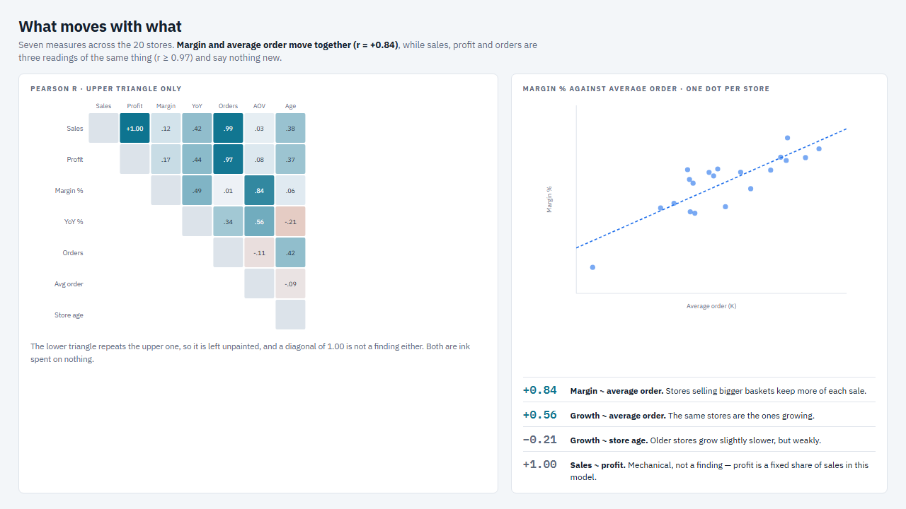
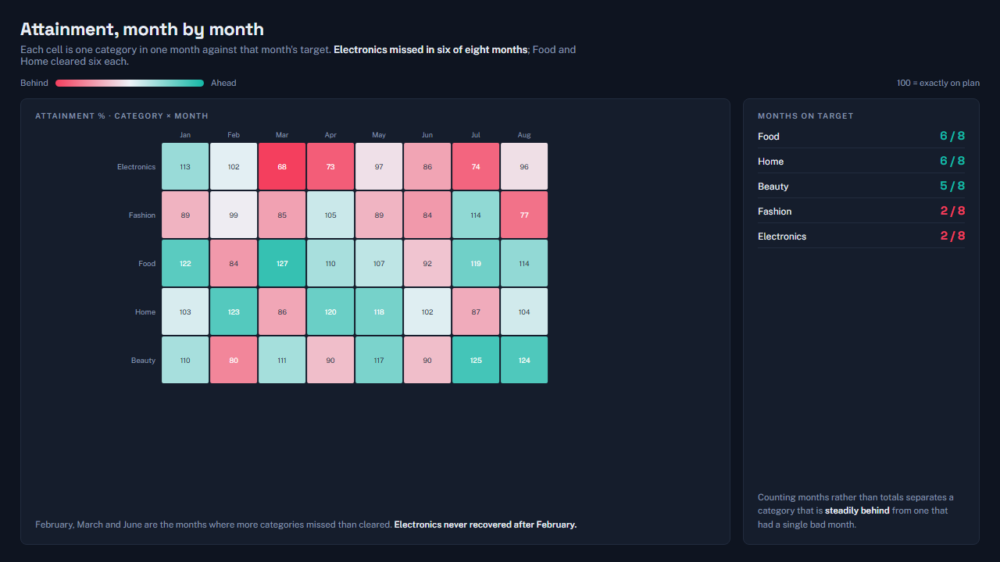
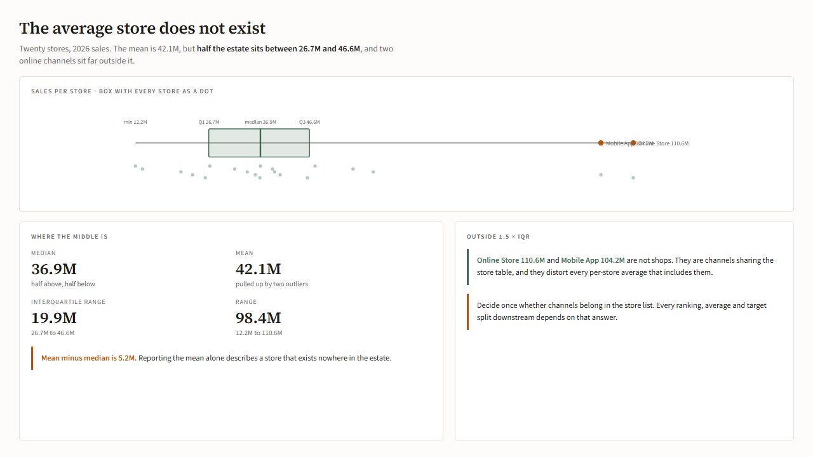
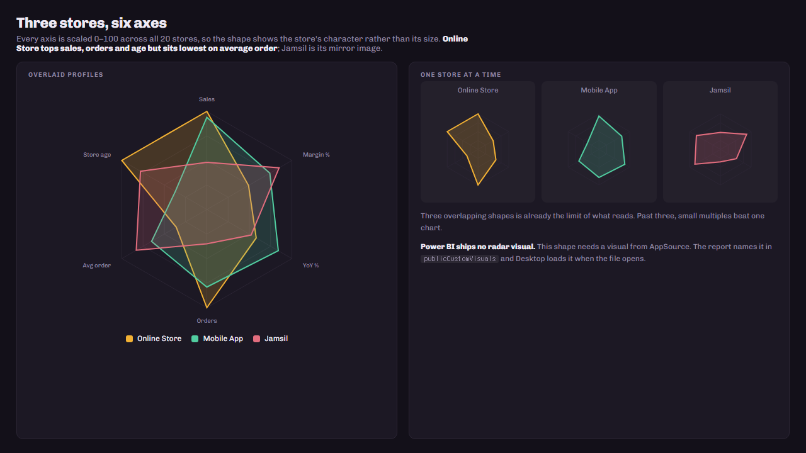
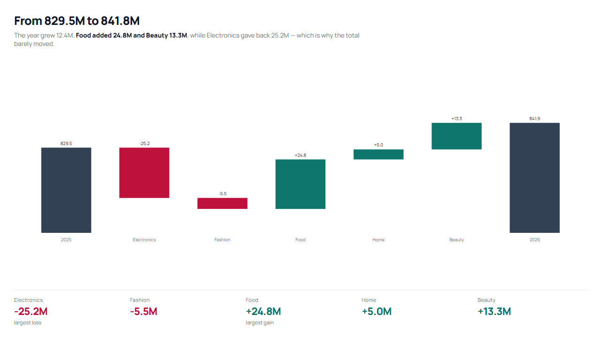

# 대시보드 구성 시안 15가지

테마를 10종까지 늘려 놓고 나란히 보니 전부 같은 리포트로 보였다. 이유는 분명하다.
**10종 모두 구성이 하나였다** — 왼쪽 어두운 레일 + 흰 카드 격자. 바뀌는 건 색·모서리·글꼴뿐이었다.

| 테마 | 레일 | 본문 | 강조색 |
|---|---|---|---|
| navy · paper · midnight · aurora · coast · ledger · contrast · universal · carbon · broadsheet | 전부 좌측 192px | 전부 카드 격자 | 색만 다름 |

색은 테마가 정하지만 **닮아 보이는 원인은 구성**이다. 그래서 Power BI로 옮기기 전에
배치·타이포·정보 구조가 서로 다른 열 가지를 HTML로 먼저 그렸다.

```bash
python design-system/prototypes/themes/build.py   # → 01-*.html … 15-*.html, index.html
```

`index.html`을 브라우저에서 열면 15개를 한 화면에서 비교할 수 있다.
숫자는 전부 [예제 03 모델](../../../examples/03-modeling-mcp/)의 실제 값(2026년 1~8월)이라,
**달라 보이는 것은 오직 디자인이다.**

## 구성 열 가지

| | 이름 | 구성 | 어울리는 자리 |
|---|---|---|---|
| 01 | **Bento** | 레일 없음. 타일 크기가 위계를 대신한다 | 요약 한 장, 사내 포털 |
| 02 | **Terminal** | 등폭 숫자, 1px 격자, 카드 없음 | 관제·실시간 모니터링 |
| 03 | **Ledger** | 면을 쓰지 않고 괘선과 정렬만 쓴다 | 재무 보고·인쇄·월말 |
| 04 | **Masthead** | 제호와 리드 문장이 먼저, 숫자가 받친다 | 이사회·월간 리뷰 |
| 05 | **Full bleed** | 차트가 캔버스를 채우고 숫자가 그 위에 뜬다 | 발표·대형 화면 |
| 06 | **Brief** | 왼쪽은 글로 결론, 오른쪽은 그림으로 근거 | 분석 보고서 |
| 07 | **Control room** | 같은 크기 타일 12개를 훑는다 | 운영 현황판 |
| 08 | **Poster** | 숫자 하나가 화면을 지배한다 | 단일 KPI·전사 공유 |
| 09 | **Split field** | 색 면과 흰 면을 맞붙인다 | 브랜드 있는 보고 |
| 10 | **Workbench** | 탭·툴바가 있고 표가 주인공 | 분석가의 작업 화면 |

<table>
<tr><td><br>01 Bento</td>
    <td><br>02 Terminal</td></tr>
<tr><td><br>03 Ledger</td>
    <td><br>04 Masthead</td></tr>
<tr><td><br>05 Full bleed</td>
    <td><br>06 Brief</td></tr>
<tr><td><br>07 Control room</td>
    <td><br>08 Poster</td></tr>
<tr><td><br>09 Split field</td>
    <td><br>10 Workbench</td></tr>
</table>

## 분석용 다섯 가지 (딥다이브)

앞의 열 가지는 "무슨 일이 있었나"를 보여 준다. 이 다섯은 **"왜 그런가"를 따지는 화면**이다.

| | 이름 | 분석 | Power BI에서 |
|---|---|---|---|
| 11 | **Correlation** | 지표 7개의 상관 행렬 + 산점도·추세선 | 행렬 + 조건부 색, 산점도 |
| 12 | **Heat grid** | 카테고리 × 월 달성률 히트맵 | 행렬 + 색 척도(이미 `heat` 서식으로 지원) |
| 13 | **Spread** | 상자 수염 + 점 흩뿌리기 + 이상치 | **기본에 없음** — 커스텀 개체 또는 Python 비주얼 |
| 14 | **Radar profile** | 매장 성격을 6축으로 비교 | **기본에 없음** — AppSource 커스텀 개체 |
| 15 | **Bridge** | 작년 → 올해 폭포 분해 | `waterfallChart` (내장, 아직 미사용) |

숫자는 모두 **실제로 계산했다**. 상관계수는 매장 20개에서 피어슨 r을 구한 값이고,
히트맵은 월별 목표 대비 실적이다. 지어낸 수치는 없다.

가장 쓸모 있던 발견 두 가지:
- **마진율 ~ 객단가 r = +0.84.** 큰 바구니를 파는 매장이 남기기도 잘 남긴다.
- **매출 ~ 이익 r = +1.00, 매출 ~ 주문 r = +0.99.** 셋은 같은 것을 세 번 재고 있다. 상관 행렬은
  이런 "당연한 쌍"을 먼저 걸러 내야 쓸모가 생긴다.

<table>
<tr><td><br>11 Correlation</td>
    <td><br>12 Heat grid</td></tr>
<tr><td><br>13 Spread</td>
    <td><br>14 Radar profile</td></tr>
<tr><td><br>15 Bridge</td><td></td></tr>
</table>

## 커스텀 개체(AppSource)는 쓸 수 있다 — 조건이 있다

레이더·상자 수염처럼 Power BI에 없는 모양은 AppSource 개체가 필요하다. 실제로 확인한 것:

| 확인한 것 | 결과 |
|---|---|
| PBIP 프로젝트의 리포트 정의(PBIR)가 커스텀 개체를 담을 수 있나 | **된다.** `report.json`의 `publicCustomVisuals` 배열에 개체 이름을 적고, 비주얼의 `visualType`을 그 이름으로 둔다 ([스키마](https://developer.microsoft.com/json-schemas/fabric/item/report/definition/report/3.3.0/schema.json)) |
| 개체 파일을 저장소에 넣어야 하나 | **아니다.** AppSource·조직 개체는 Desktop이 열 때 자동으로 불러온다. 프로젝트 폴더에 들어가는 건 사설(pbiviz) 개체뿐이다 ([문서](https://learn.microsoft.com/en-us/power-bi/developer/projects/projects-report)) |
| 공식 검증을 통과하나 | **경고가 난다.** `PBIR_VISUAL_TYPE_UNKNOWN`. 이 저장소 CI는 "오류 0 · 경고 0"이 기준이라, 쓰려면 아는 개체 이름을 예외로 등록해야 한다 |
| 개체의 정확한 이름 | **아직 모른다.** Desktop에 한 번 설치해 `report.json`에 적히는 이름을 읽어야 확정된다. 추측해서 넣으면 안 열린다 |

그래서 현재 계획은 **내장 개체로 갈 수 있는 데까지 먼저 가는 것**이다(11·12·15는 내장으로 가능).
13·14는 개체 이름을 확인한 뒤에 넣는다.


## 캔버스는 1280×720으로 맞췄다

Power BI 페이지와 같은 크기다. HTML에서만 예쁘고 옮기면 깨지는 일을 막으려고,
시안도 같은 고정 캔버스 안에서 끝나야 한다는 조건을 걸었다. 스크롤되는 시안은 쓰지 않는다.

캡처는 헤드리스 Chrome으로 같은 크기에서 찍었다.

```bash
chrome --headless=new --window-size=1280,720 --screenshot=out.png <파일>
```

## 다음

고른 방향을 `design-system/layouts/`의 레이아웃 템플릿과 `tokens.json`의 테마로 옮긴다.
구성이 바뀌는 것이므로 색 토큰만으로는 끝나지 않고, 레이아웃 템플릿이 함께 늘어난다.

분석용 다섯 가지 중 **11·12·15는 내장 개체만으로 옮길 수 있다.** 13·14는 AppSource 개체 이름을
Desktop에서 한 번 확인한 뒤에 넣는다.
