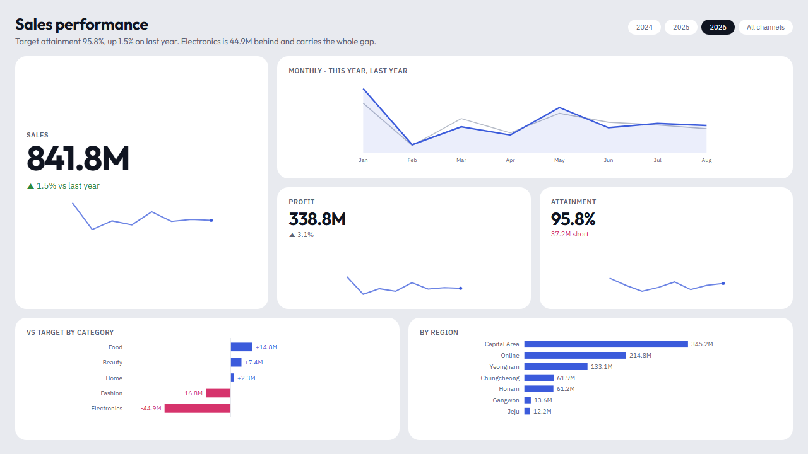
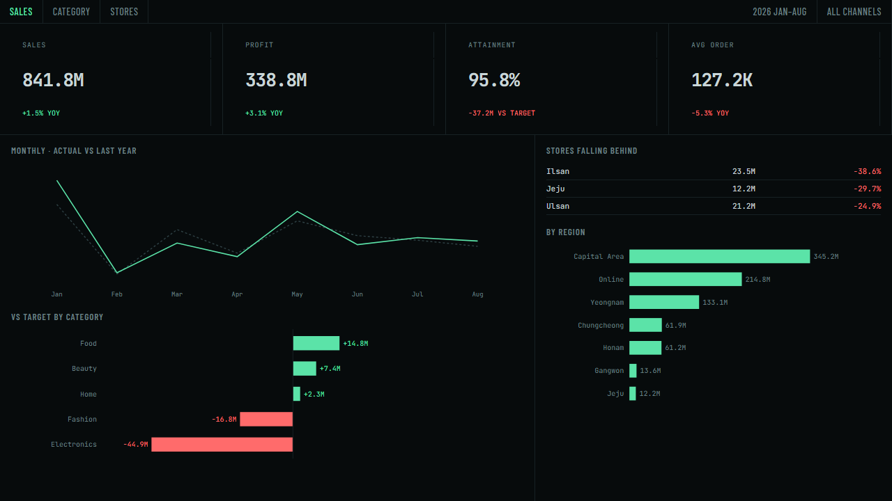
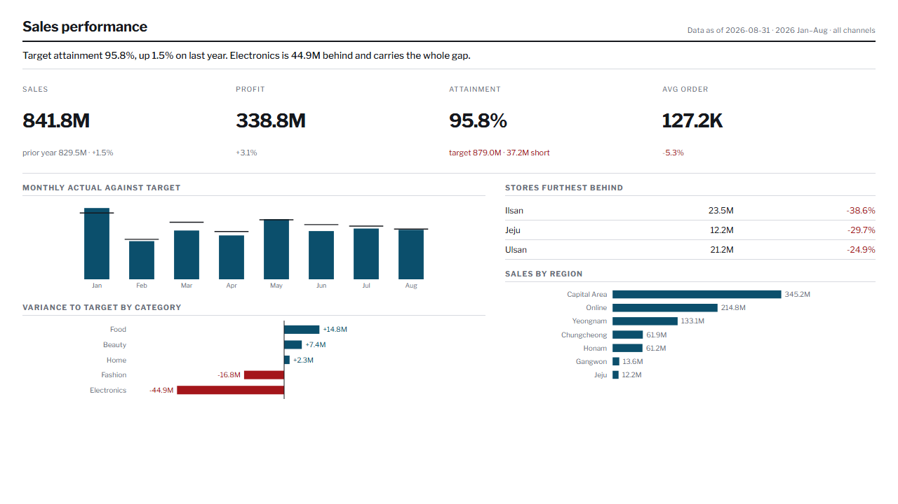
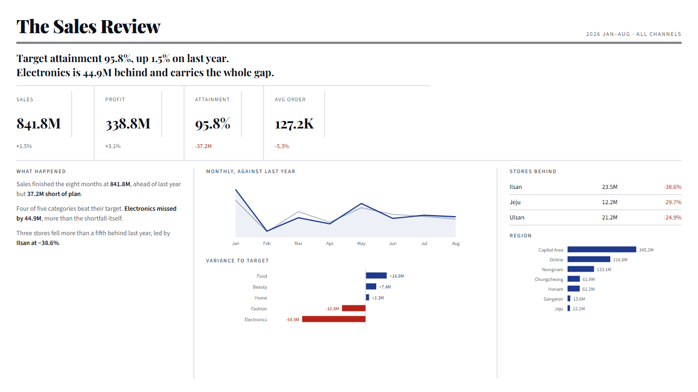
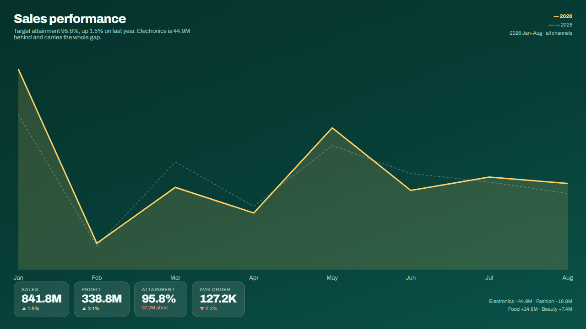
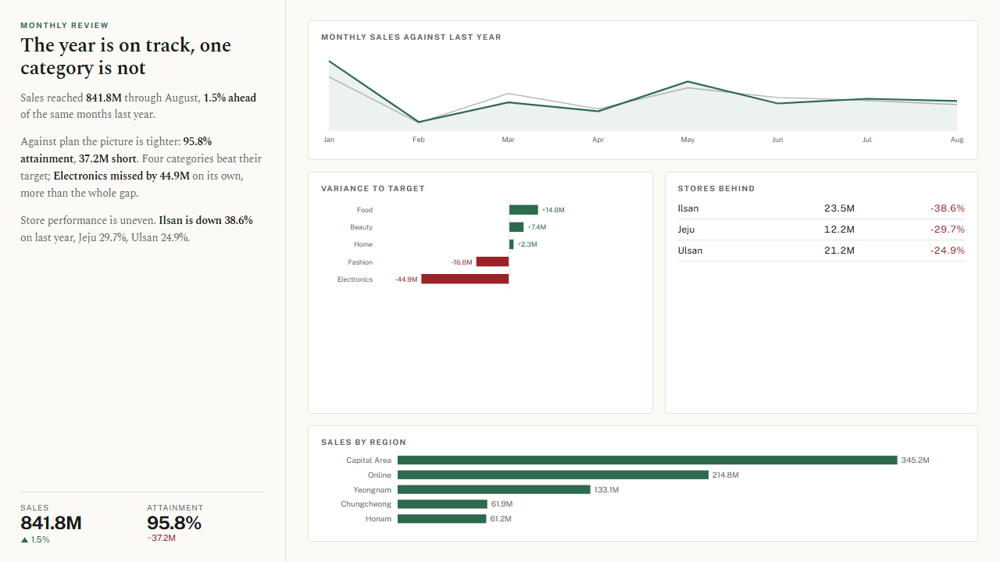
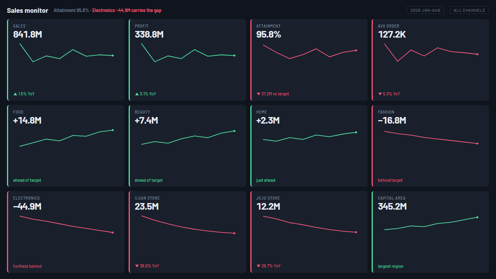
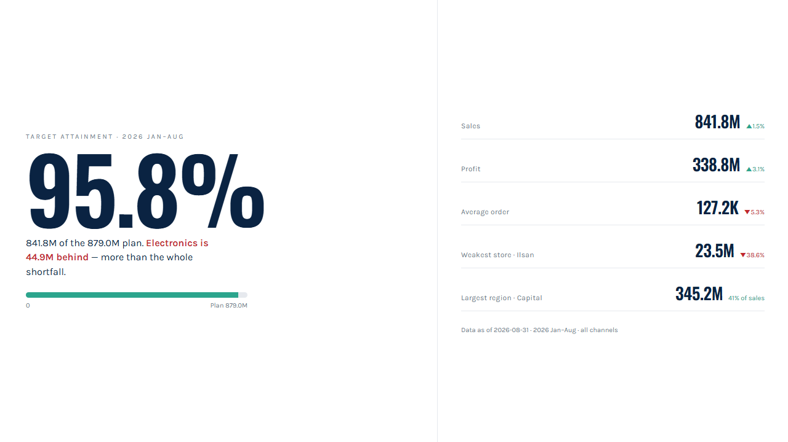
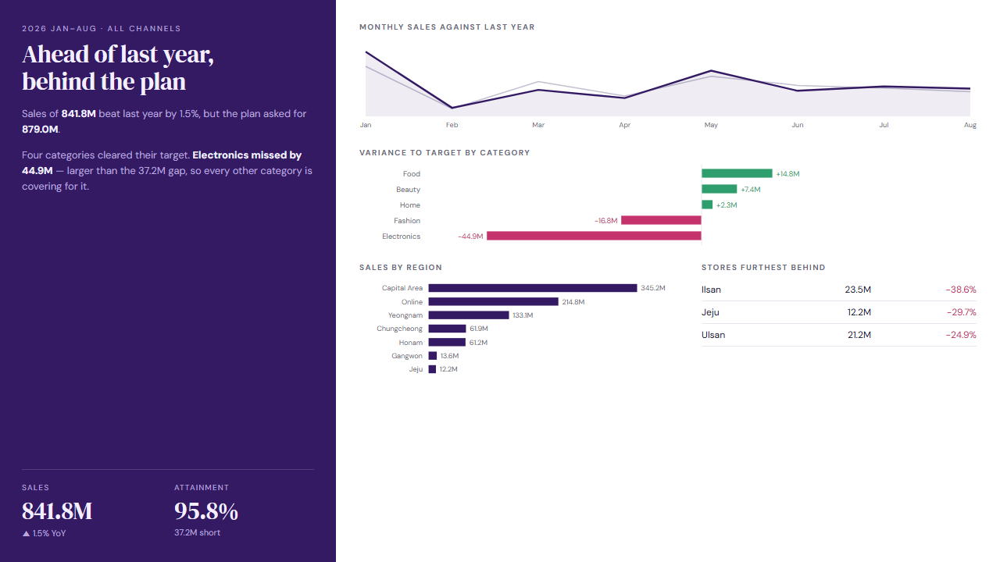
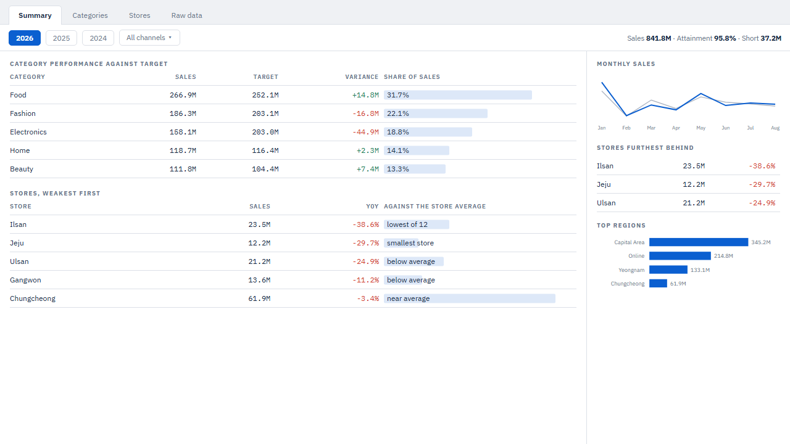

# 대시보드 구성 시안 10가지

테마를 10종까지 늘려 놓고 나란히 보니 전부 같은 리포트로 보였다. 이유는 분명하다.
**10종 모두 구성이 하나였다** — 왼쪽 어두운 레일 + 흰 카드 격자. 바뀌는 건 색·모서리·글꼴뿐이었다.

| 테마 | 레일 | 본문 | 강조색 |
|---|---|---|---|
| navy · paper · midnight · aurora · coast · ledger · contrast · universal · carbon · broadsheet | 전부 좌측 192px | 전부 카드 격자 | 색만 다름 |

색은 테마가 정하지만 **닮아 보이는 원인은 구성**이다. 그래서 Power BI로 옮기기 전에
배치·타이포·정보 구조가 서로 다른 열 가지를 HTML로 먼저 그렸다.

```bash
python design-system/prototypes/themes/build.py   # → 01-*.html … 10-*.html, index.html
```

`index.html`을 브라우저에서 열면 10개를 한 화면에서 비교할 수 있다.
숫자는 전부 [예제 03 모델](../../../examples/03-modeling-mcp/)의 실제 값(2026년 1~8월)이라,
**달라 보이는 것은 오직 디자인이다.**

## 열 가지

| | 이름 | 구성 | 어울리는 자리 |
|---|---|---|---|
| 01 | **Bento** | 레일 없음. 타일 크기가 위계를 대신한다 | 요약 한 장, 사내 포털 |
| 02 | **Terminal** | 등폭 숫자, 1px 격자, 카드 없음 | 관제·실시간 모니터링 |
| 03 | **Ledger** | 면을 쓰지 않고 괘선과 정렬만 쓴다 | 재무 보고·인쇄·월말 |
| 04 | **Masthead** | 제호와 리드 문장이 먼저, 숫자가 받친다 | 이사회·월간 리뷰 |
| 05 | **Full bleed** | 차트가 캔버스를 채우고 숫자가 그 위에 뜬다 | 발표·대형 화면 |
| 06 | **Brief** | 왼쪽은 글로 결론, 오른쪽은 그림으로 근거 | 분석 보고서 |
| 07 | **Control room** | 같은 크기 타일 12개를 훑는다 | 운영 현황판 |
| 08 | **Poster** | 숫자 하나가 화면을 지배한다 | 단일 KPI·전사 공유 |
| 09 | **Split field** | 색 면과 흰 면을 맞붙인다 | 브랜드 있는 보고 |
| 10 | **Workbench** | 탭·툴바가 있고 표가 주인공 | 분석가의 작업 화면 |

<table>
<tr><td><br>01 Bento</td>
    <td><br>02 Terminal</td></tr>
<tr><td><br>03 Ledger</td>
    <td><br>04 Masthead</td></tr>
<tr><td><br>05 Full bleed</td>
    <td><br>06 Brief</td></tr>
<tr><td><br>07 Control room</td>
    <td><br>08 Poster</td></tr>
<tr><td><br>09 Split field</td>
    <td><br>10 Workbench</td></tr>
</table>

## 캔버스는 1280×720으로 맞췄다

Power BI 페이지와 같은 크기다. HTML에서만 예쁘고 옮기면 깨지는 일을 막으려고,
시안도 같은 고정 캔버스 안에서 끝나야 한다는 조건을 걸었다. 스크롤되는 시안은 쓰지 않는다.

캡처는 헤드리스 Chrome으로 같은 크기에서 찍었다.

```bash
chrome --headless=new --window-size=1280,720 --screenshot=out.png <파일>
```

## 다음

고른 방향을 `design-system/layouts/`의 레이아웃 템플릿과 `tokens.json`의 테마로 옮긴다.
구성이 바뀌는 것이므로 색 토큰만으로는 끝나지 않고, 레이아웃 템플릿이 함께 늘어난다.
