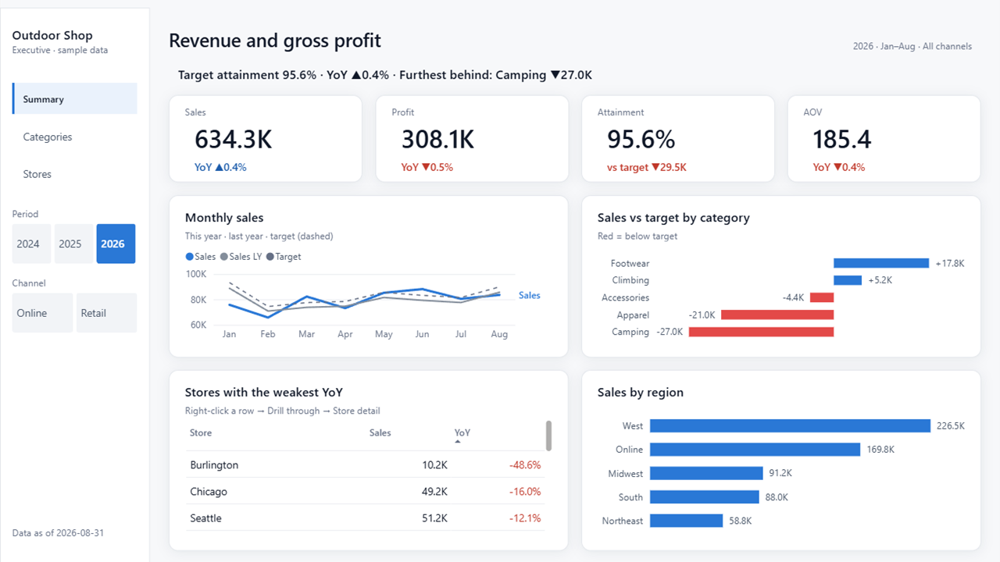

# What one report costs, and how long it takes

**About $0.6–4 per report on Claude Opus 5 API pricing, and 2–10 minutes from the request to every page captured in Power BI Desktop.**
Measured on 2026-09-16 by building two reports end to end.

| Run | Request | Pages | Requests | Output tokens | Time | Cost (fresh session) |
|---|---|---:|---:|---:|---:|---:|
| A · bundled model | (in Korean) "A one-page executive sales summary for August 2026: sales, profit, attainment, YoY, and performance by category, channel and store." Navy, Korean | 1 (+ drill-through) | 8 | 3.7K | 2 min 26 s | $0.57–0.93 |
| B · a model it had never seen | "An executive sales dashboard on my own model: revenue, gross profit, attainment against budget, YoY, by category, region and store." Paper, English | 4 | 28 | 20.2K | 7 min 35 s | $2.07–2.43 |

Time runs from the request to the last page checked by eye. It includes generating the PBIP, Microsoft's validator,
opening the report in Power BI Desktop, refreshing the data and capturing every page, which alone takes about 1.5 minutes per pass.



## What each run did

**A** copied the dashboard pilot, kept the summary page (the store-detail page stays as a hidden drill-through target),
swapped the region bar for a channel bar and changed the titles. It built on the first try: 0 errors, 0 warnings.

**B** pointed `new_report.py --model` at the outdoor-shop model. The tool listed 10 columns and 13 measures the pilot needed.
Filling the map took one write: 8 column names and 14 measures, including last-year and budget measures that stop at the last data date,
and a budget that only knows categories as text, joined with `TREATAS`. The numbers matched the source CSVs
(revenue 634.3K, +0.4% YoY, attainment 95.6%, Burlington −48.6%). B also paid for two things a user wouldn't:

- a fix to `new_report.py`, which flagged `SalesV` (a name the sparkline measure creates inside its own DAX) as a missing measure
- a second Desktop pass after shortening a rail subtitle that wrapped, and a zoom to check that `3,422` wasn't `3.422`

So B is closer to the top of the band than a typical run.

## How the cost was worked out

Prices: Claude Opus 5, $5 per million input tokens, $25 output, $10 for 1-hour cache writes, $0.50 for cache reads.

The runs happened inside a long working session, so every request re-read about 150K tokens of earlier conversation.
A new session starts much smaller: the first request of this project's first session carried 45.8K tokens (rounded up to 50K here).
The table removes the difference from the cache reads:

```
fresh cache reads = measured cache reads − requests × (context at the run's first request − 50K)
```

The low end assumes the fixed part of the prompt is already cached (as it was in that first session: 31.9K read, 13.9K written);
the high end writes all 50K. Measured in the working session, without the conversion, A cost $0.84 and B $3.53.
Totals come from `python tools/token_usage.py --start <UTC> --end <UTC>`.

## The band, and what widens it

| Case | Cost | Time |
|---|---:|---:|
| A pilot on the bundled model, small changes | $0.6–1.5 | 2–4 min |
| The first report on your own model | $2–4 | 5–10 min |

The top of each band leaves room for what these runs didn't pay: an agent new to the repo reads the skill and a few files first,
and a wrong DAX name costs one more generate. Larger models and more pages add output tokens mostly in the model map.

**Limits.** Two runs, measured by the agent that built the repo. Separate new sessions with this repo's skill,
Microsoft's `powerbi-authoring` skill and data-goblin's skills, on the same request, are next ([comparison plan](01_comparison-plan.md), Korean).

For scale: building this whole project over five days in one long session came to about 275M tokens, $262 at the same prices.
That's development, not the cost of a report.
