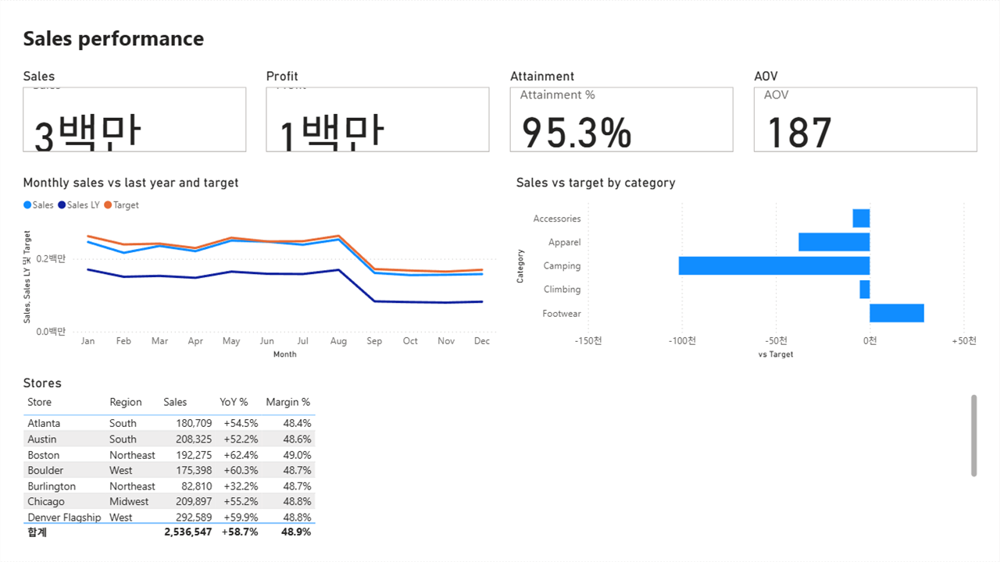
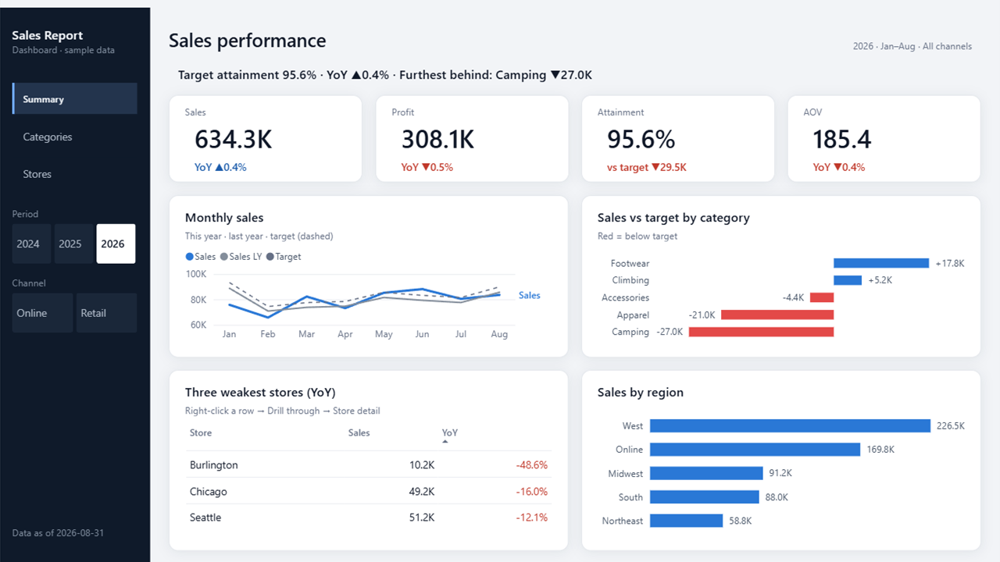

# Example 01 · the same page, authored two ways

Microsoft ships an official Claude Code plugin for Power BI authoring ([microsoft/skills-for-fabric](https://github.com/microsoft/skills-for-fabric)).
This repo claims two things it does differently: **fewer tokens** and **a finished-looking page**. Claims need a control, so here is the
same request, on the same model, finished both ways.

| | Following the Microsoft skill | This repo |
|---|---|---|
|  | 8 visuals written by hand |  |

## The setup

Same everything except the method:

- **Model**: one semantic model built by `tools/new_model.py --csv examples/_data/outdoor-shop`, then ten English measures added by
  hand (Sales, Profit, Sales LY, Target, Attainment %, AOV, …). Both runs bind to a copy of it, so no model work is being compared.
- **Request**: a sales dashboard page — Sales, Profit, target attainment and AOV as KPIs; monthly sales against last year and target;
  sales vs target by category; a store table.
- **Finish line**: `powerbi-report-author validate` reports 0 errors, and Power BI Desktop renders the page.

## What each method costs

Instruction size is measured with the same instrument for all three (`claude plugin details`), file sizes with `wc -c`.

| | Instructions the agent must read | What the agent writes by hand | Output |
|---|---|---|---|
| **This repo** (`new-report`) | SKILL.md 5.4 KB · **~1.7k tokens on invoke**, ~26 always-on | the model map, 5.1 KB (~1.7k tokens) | 4 pages, 55 visuals, themed |
| **Microsoft** (`powerbi-report-cli`) | SKILL.md 12.9 KB + `planning` 22.6 + `design` 16.7 + `authoring` 36.6 = **~89 KB**, plus a topic file per visual family · ~4.4k tokens on invoke (+14.7k for the model skill), ~345 always-on | every `visual.json`: **13.7 KB for 8 visuals** (1.7 KB per visual) | 1 page, 8 visuals, base theme |
| **data-goblin** (`reports`) | five skills, SKILL.md files ~97 KB together · **~32.6k tokens** if all four authoring skills fire, ~1,017 always-on | — (example 02) | — |

The Microsoft CLI is a **lookup and validation** tool — `catalog`, `formatting`, `expr`, `theme`, `validate`, `preview-*`. There is no
command that creates a page or a visual, so the agent writes the JSON. At 1.7 KB per visual, the 55 visuals this repo generates would be
about **94 KB (~24k tokens) of hand-written JSON**, against a 5.1 KB model map.

That is not a criticism of the skill; it is the skill's own advice. From its authoring reference:

> "When context or repetition is the constraint, prefer a deterministic Node.js generator that reads the approved design brief and
> writes PBIR JSON."
> — `references/authoring.md`, microsoft/skills-for-fabric (MIT)

This repo is that generator, with the design brief moved into pilots and a theme.

## What the validator did not catch

Both pages pass `powerbi-report-author validate` with **0 errors and 0 warnings**. On screen, the hand-authored page shows:

| What you see | Why |
|---|---|
| `3백만`, `1백만` in the Sales and Profit cards | Desktop's auto-units, in the display language of the machine. One significant digit, and Korean on a Korean Desktop |
| Card labels clipped behind the value | Default card layout with a label and no height budget for it |
| Sales 2,536,547 and YoY +58.7% | No period filter, so three years are summed and "last year" compares against a mixture |
| Category bars in alphabetical order, all one colour | No sort and no semantic colour: the worst category is not where the eye lands |
| Store table alphabetical, scrolling, total row labelled `합계` | No Top N, no sort, and the total label follows Desktop's language |
| No takeaway sentence, no filter context, no as-of date | Nothing in PBIR requires them |

The generated page has none of these, because they are decided once in the pilot and the theme instead of per visual: measures return
pre-formatted text so auto-units never apply, the takeaway sentence is a DAX measure, the table carries a Top N filter, and bars take
their colour from the sign.

**The honest caveat**: the hand-authored run is deliberately a first pass — no slicer, no custom theme, no ranking filter. A careful
agent following the skill's full `planning → design → authoring` flow would add them. That is the point of the number: each of those is
more hand-written JSON, and the page above is what the cheapest correct-by-the-validator run looks like.

## Scores

Both pages scored with [the repo's rubric](../../design-system/review-rubric.md), single-page scale (40 points).

| | Hand-authored | Generated |
|---|---:|---:|
| A. Purpose and hierarchy | 4/8 | 8/8 |
| B. Layout | 6/8 | 8/8 |
| C. Charts | 6/8 | 8/8 |
| D. Numbers and type | 4/6 | 6/6 |
| E. Colour | 4/6 | 6/6 |
| F. Context and interaction | 1/4 | 4/4 |
| **Total** | **25/40**, one critical failure (A1: no takeaway sentence) | **40/40** |

**Read that comparison with its bias in mind.** This repo wrote the rubric, and the pilots were built against it, so a 40/40 measures
"we did what we set out to do", not "this is objectively better". The part that stands on its own is the defect list above: those are
observable on screen by anyone, and none of them were caught by the validator. Outside scores are the missing piece — the design
feedback form takes a 1–5 rating, and that rating is what would make this section worth more than it is now.

## Reproducing it

```bash
claude plugin marketplace add microsoft/skills-for-fabric
claude plugin install powerbi-authoring@fabric-collection
claude plugin details powerbi-authoring@fabric-collection     # the token numbers above

python tools/new_model.py --name OutdoorShared --out out/shared-model --csv examples/_data/outdoor-shop
#  add the ten English measures to out/shared-model/tables/Metrics.tmdl (listed in prompts.md)

#  the hand-authored run: this folder's MsDashboard.Report, bound to a copy of that model
powerbi-report-author validate examples/01-microsoft-skill/MsDashboard.Report

#  the generated run
python tools/new_report.py --purpose dashboard --theme navy --lang en --name ApDashboard --model out/shared-model --out out/ap-run
#  fill out/ap-run/model-map.json (the filled version is in prompts.md), then
python tools/generate_pbir.py out/ap-run/report.spec.json
```

`MsDashboard.Report/` here is the PBIR written by hand during the run; nothing from the Microsoft plugin is copied into this repo.
Their skills stay where `claude plugin install` puts them.
