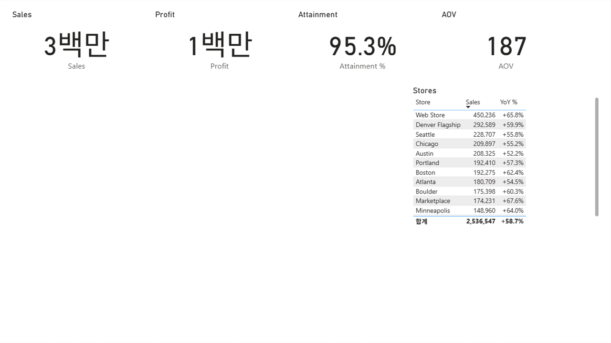

# Example 02 · the same page with data-goblin's toolkit

[data-goblin/power-bi-agentic-development](https://github.com/data-goblin/power-bi-agentic-development) (GPL-3.0) is the other
widely used Claude Code plugin for Power BI. Where [example 01](../01-microsoft-skill/README.md) compared instructions and
hand-written JSON, this one compares a toolkit that **does** generate: its skills drive `pbir`, a CLI with creation commands.

Nothing from that repository is copied here. It was installed with `claude plugin install` and used as a user would.

## What it costs to load

Measured with the same instrument as example 01 (`claude plugin details`):

| Plugin | Always-on | On invoke |
|---|---:|---|
| `reports@power-bi-agentic-development` | ~1,017 tok | `create-pbi-report` 5.2k + `pbi-report-design` 7.7k + `pbir-cli` 13.6k + `review-report` 6.1k = **~32.6k** |
| `powerbi-authoring@fabric-collection` | ~345 tok | report 4.4k (+ model 14.7k) |
| this repo (`new-report`) | ~26 tok | **~1.7k** |

Its five SKILL.md files come to about 97 KB; the `pbir-cli` skill alone is 37 KB and its folder carries 119 files.

## Where it stopped: creating a report needs Fabric

```
$ pbir new report "GoblinDashboard.Report" -c "../shared-model"
Error: Could not acquire a Fabric token (user): no token returned

$ pbir new report "GoblinDashboard.Report" -c "GoblinModel.SemanticModel"
Error: Connection must be in format 'Workspace/Model.SemanticModel'
```

`pbir new report` binds a **published** semantic model in a Fabric or Power BI workspace, and signs in to do it. There is no
local-model path: the skill says so up front ("a published semantic model in Fabric or Power BI is required first"). This repo
never leaves the local folder — the same difference that shows up with warehouses, seen from the other side.

So the comparison continues where it can: `pbir` edits **local** reports happily, so the page was built with `pbir add visual`
on a report scaffolded by hand.

## Building the page with `pbir add visual`

Seven commands, one per visual:

```bash
pbir add visual card "R.Report/Page.Page" --title "Sales" -d "values:Metrics.Sales"
pbir add visual card … --title "Profit"      -d "values:Metrics.Profit"
pbir add visual card … --title "Attainment"  -d "values:Metrics.Attainment %"
pbir add visual card … --title "AOV"         -d "values:Metrics.AOV"
pbir add visual lineChart … -d "Category:Calendar.Month" -d "Y:Metrics.Sales" -d "Y:Metrics.Sales LY" -d "Y:Metrics.Target"
pbir add visual barChart  … -d "Category:Products.Category" -d "Y:Metrics.vs Target"
pbir add visual tableEx   … -d "Values:Stores.Store" -d "Values:Metrics.Sales" -d "Values:Metrics.YoY %"
```

This is the part that works well. The commands are short, the CLI places visuals automatically, role names are checked
(`Role 'values' not valid for lineChart. Available: Category, Y, Y2, Rows, Tooltips`), and the JSON it writes is well formed.
**About 600 bytes of commands for 7 visuals** — the same order of magnitude as this repo's spec, and far below hand-writing
PBIR. On token cost for the writing step, `pbir` and this repo are close; the gap in example 01 was against hand-authoring.

## What the screen showed



Both validators pass:

- `pbir validate --fields --qa` → `Valid (1 info)`, 7 visuals, 20 fields resolved against the loaded model
- `powerbi-report-author validate` → 0 errors, 0 warnings

In Power BI Desktop 2.157, **the two charts do not appear**. Four cards and the table render; the line chart at (20,180) and the
bar chart at (440,180) are blank canvas. Nothing is drawn there — no placeholder, no error text.

### Hypotheses tested, and ruled out

Each of these was a separate build and a separate Desktop capture:

| # | Hypothesis | Test | Result |
|---|---|---|---|
| 1 | The category projection is missing `"active": true`, which this repo always writes | Added it to both charts | Still blank |
| 2 | The `sortDefinition` the CLI adds (a measure, descending, on a line chart) or `z: 0` breaks it | Removed the sort, set z/tabOrder | Still blank |
| 3 | The capture fires before the slower chart queries finish | Re-captured with a warm cache | Still blank |
| 4 | 400×300 is too small for a 3-series line chart | The same JSON at 400×300, 600×300, 400×200, 600×200, alone on a page | **All four rendered** |

Test 4 is the informative one: the CLI's JSON, unmodified, renders correctly when it is the only thing on the page. So the JSON
is acceptable to Desktop, and something about the combination on that page is not. Two further attempts to bisect by removing
the cards or the table produced reports that would not open at all, and the search was stopped there.

**The honest summary: the cause is unknown.** What is established is narrower and still worth writing down — a report that two
independent validators call clean, including a field-level check against the loaded model, rendered without two of its seven
visuals on Desktop 2.157, and no tool in the chain said anything.

That is the same lesson this repo keeps relearning from the other side: [25+ issues](../../docs/progress-log.md) that passed
validation and broke on screen. It is the reason every page here is opened in Desktop and captured before anything is called
finished — and the reason this example does not get a rubric score: two of its visuals never reached the screen.

## What transfers

- **`pbir` is a real generator.** For writing PBIR from an agent, its commands are compact and its role checking is good. The
  parts this repo does differently are the pilots (a finished page instead of a blank one), the theme, and the Desktop capture
  loop — not the act of writing JSON.
- **Local-first matters.** `pbir new report` needs a Fabric sign-in and a published model. Anyone learning on their own laptop,
  with a folder of CSVs, cannot start there.
- **Two validators, one blind spot.** Both said the report was fine. Only the screenshot disagreed.

## Reproducing it

```bash
claude plugin marketplace add data-goblin/power-bi-agentic-development
claude plugin install reports@power-bi-agentic-development
claude plugin details reports@power-bi-agentic-development      # the token numbers above
pip install pbir-cli                                            # Custom Non-Commercial License - check it fits your use
```

Then the seven `pbir add visual` commands above, against a local report bound to the model from
[example 01](../01-microsoft-skill/prompts.md), and `tools/render_check.ps1 -Dir <folder>` to see what Desktop does with it.
