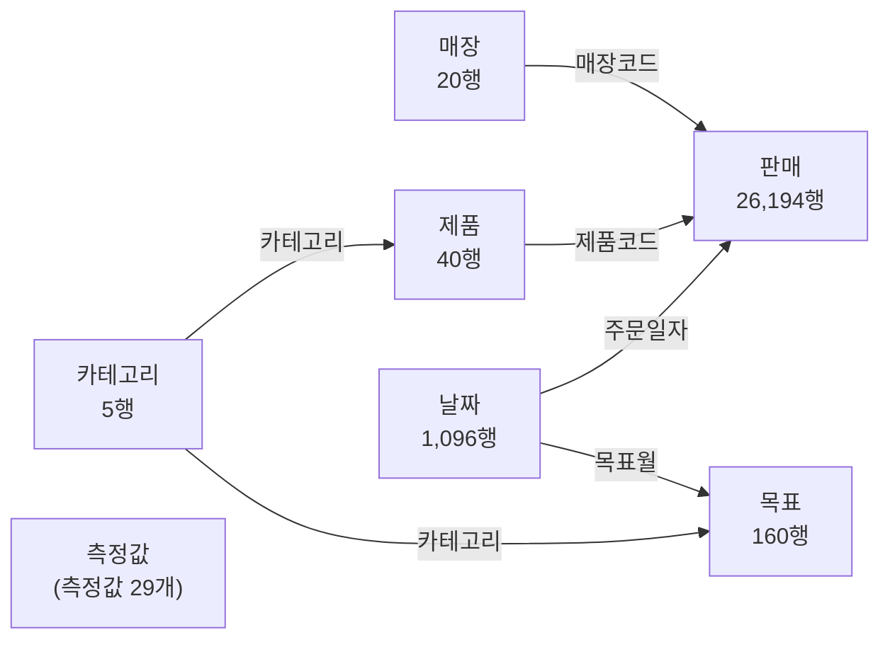

# 예제 03 모델 문서 — Power BI Modeling MCP만으로 작성

실행 중인 Power BI Desktop에 Modeling MCP로 접속해 빈 모델에서 시작했다.
테이블·관계·측정값을 만들고, DAX 쿼리로 숫자를 검증했다.
리포트 페이지는 없다. MCP README에 "리포트 페이지는 수정할 수 없다"고 명시되어 있기 때문이다.

- 테이블 7개 · 관계 6개 · 측정값 29개 · 매개변수 1개
- 원본: [공용 데이터](../_data/korean-retail/README.md) CSV 4종
- 텍스트 원본: [`tmdl/`](tmdl/) (MCP `ExportToTmdlFolder`로 내보냄)

## 관계도

화살표는 필터가 흐르는 방향이다 (1쪽 → 다쪽). 모든 관계는 단방향이다.

## 테이블

| 테이블 | 행 | 종류 | 만든 방법 |
|---|---:|---|---|
| 판매 | 26,194 | 사실(fact) | CSV 가져오기 (Power Query) |
| 목표 | 160 | 사실 (카테고리 × 월) | CSV 가져오기 |
| 제품 | 40 | 차원 | CSV 가져오기 |
| 매장 | 20 | 차원 | CSV 가져오기 |
| 날짜 | 1,096 | 차원 (날짜 테이블로 지정) | DAX 계산 테이블, 2024-01-01 ~ 2026-12-31 |
| 카테고리 | 5 | 공통 차원 | DAX 계산 테이블 `DISTINCT('제품'[카테고리])` |
| 측정값 | 1 | 측정값 보관용 | DAX 계산 테이블 `ROW("_", BLANK())`, 열 숨김 |

## 설계 결정과 이유

1. **카테고리 공통 차원**: 목표는 "카테고리 × 월" 단위다. 카테고리를 제품 테이블에만 두면 목표를 함께 거를 수 없다.
   그래서 카테고리 테이블 하나가 제품(→판매)과 목표를 동시에 거르게 했다.
   `VALUES` 대신 `DISTINCT`를 써서 순환 종속을 피했다.
2. **실적기간 열** (`날짜[실적기간]`): 마지막 판매일(2026-08-31)까지만 TRUE다.
   이 열이 없으면 "2026년 전체"를 볼 때 전년 비교가 2025년 1~12월 전체와 비교된다(올해는 8월까지밖에 없는데).
   전년 측정값은 실적이 있는 날짜만 1년 전으로 옮긴다.
3. **목표는 매장·제품 단위에서 빈칸**: 목표가 매장·제품 단위로 정해져 있지 않다.
   그래서 매장별 표에 달성률을 넣으면 "매장 매출 ÷ 전사 목표" 같은 틀린 값이 나온다. 이 경우 빈칸을 반환한다.
4. **억 단위 측정값 별도 작성**: 서식 문자열의 `,`는 1,000 단위로만 나눈다. 1억(10^8)으로는 나눌 수 없다.
   그래서 `매출 (억)`처럼 값을 직접 나눈 표시용 측정값을 따로 만들었다 (서식 `#,0.0"억"` → `8.4억`).
5. **정리 규칙**: 측정값은 전용 테이블에 폴더별로 모았다. 키 열과 원본 숫자 열은 숨겼다. 암시적 측정값을 억제하고 자동 날짜 테이블을 껐다.
6. **데이터폴더 매개변수**: CSV 경로를 한 곳에서 관리한다. 다른 PC에서는 이 값만 바꾸면 된다.

## 측정값 (29개)

| 폴더 | 측정값 | 식 | 서식 |
|---|---|---|---|
| 1. 기본 | 매출 | `SUM('판매'[매출액])` | `#,0` |
| | 원가 | `SUM('판매'[원가])` | `#,0` |
| | 이익 | `[매출] - [원가]` | `#,0` |
| | 이익률 | `DIVIDE([이익], [매출])` | `0.0%` |
| | 판매수량 | `SUM('판매'[수량])` | `#,0` |
| | 주문건수 | `COUNTROWS('판매')` | `#,0` |
| | 객단가 | `DIVIDE([매출], [주문건수])` | `#,0` |
| | 평균할인율 | `1 - DIVIDE([매출], SUMX('판매', '판매'[수량] * '판매'[정가]))` | `0.0%` |
| 2. 목표 | 목표매출 | `IF(ISFILTERED('제품') \|\| ISCROSSFILTERED('매장'), BLANK(), SUM('목표'[목표매출액]))` | `#,0` |
| | 목표 달성률 | `DIVIDE([매출], [목표매출])` | `0.0%` |
| | 목표 대비 차이 | `IF(NOT ISBLANK([목표매출]), [매출] - [목표매출])` | `+#,0;-#,0;0` |
| 3. 전년 대비 | 전년 매출 | `CALCULATE([매출], CALCULATETABLE(SAMEPERIODLASTYEAR('날짜'[날짜]), '날짜'[실적기간] = TRUE()))` | `#,0` |
| | 전년 대비 증감 | `IF(NOT ISBLANK([매출]) && NOT ISBLANK([전년 매출]), [매출] - [전년 매출])` | `+#,0;-#,0;0` |
| | 전년 대비 증감률 | `IF(NOT ISBLANK([매출]), DIVIDE([매출] - [전년 매출], [전년 매출]))` | `+0.0%;-0.0%;0.0%` |
| | 전년 이익 | 전년 매출과 같은 방식, `[이익]` 기준 | `#,0` |
| | 이익 증감률 | `IF(NOT ISBLANK([이익]), DIVIDE([이익] - [전년 이익], [전년 이익]))` | `+0.0%;-0.0%;0.0%` |
| 4. 누계 | 매출 YTD | `CALCULATE([매출], DATESYTD('날짜'[날짜]))` | `#,0` |
| | 전년 매출 YTD | `CALCULATE([매출 YTD], CALCULATETABLE(SAMEPERIODLASTYEAR('날짜'[날짜]), '날짜'[실적기간] = TRUE()))` | `#,0` |
| | 매출 YTD 증감률 | `DIVIDE([매출 YTD] - [전년 매출 YTD], [전년 매출 YTD])` | `+0.0%;-0.0%;0.0%` |
| | 목표매출 YTD | `CALCULATE([목표매출], DATESYTD('날짜'[날짜]))` | `#,0` |
| | 목표 달성률 YTD | `DIVIDE([매출 YTD], [목표매출 YTD])` | `0.0%` |
| 5. 억 단위 표시 | 매출 (억) · 이익 (억) · 매출 YTD (억) · 목표매출 YTD (억) | `DIVIDE([원래 측정값], 100000000)` | `#,0.0"억"` |
| 6. 구성비 | 온라인 매출 비중 | `DIVIDE(CALCULATE([매출], '매장'[채널] = "온라인"), [매출])` | `0.0%` |
| | 매출 구성비 | `DIVIDE([매출], CALCULATE([매출], ALLSELECTED()))` | `0.0%` |
| 7. 기준 | 기준일 | `CALCULATE(MAX('판매'[주문일자]), REMOVEFILTERS())` | `yyyy-mm-dd` |
| | 기준일 표시 | `"기준일 " & FORMAT([기준일], "yyyy.mm.dd")` | — |

## DAX 검증 결과

MCP의 `dax_query_operations`로 측정값을 실행했다. 그 값을 데이터를 만들 때 Python으로 계산한 값과 비교했다.

| 확인 항목 | DAX 결과 | 기대값 | 결과 |
|---|---|---|---|
| 판매 행 수 / 총매출 | 26,194 / 3,575,712,605원 | 26,194 / 35.8억 | ✅ |
| 2026년 1~8월 카테고리 누계 증감률 | 가전 −7.3%, 패션 −3.1%, 식품 +17.2%, 생활용품 +8.7%, 뷰티 +12.4% | 같음 | ✅ |
| 채널 증감률 | 오프라인 −3.3%, 온라인 +18.6% | 같음 | ✅ |
| 매장 증감률 | 일산점 −38.6%, 판교점 +13.3%, 강남점 +8.8%, 홍대점 −2.2% | 같음 | ✅ |
| 매장 단위 목표매출 | 빈칸 | 빈칸 | ✅ |
| 2026년 전체의 전년 매출 | 8.30억 (2025년 1~8월) | 2025년 1~8월 | ✅ |
| 2026년 KPI | 매출 8.4억 (+1.5%), 이익률 40.3%, 목표 달성률 95.8%, 온라인 비중 25.5% | — | 참고 |
