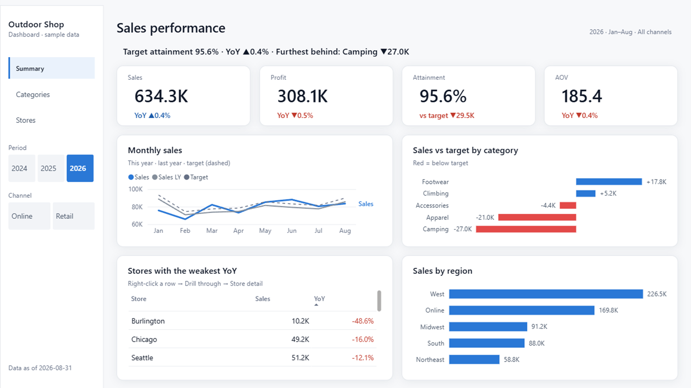

# Example 05 · a pilot on your own model

The pilots are written for one reference model (Korean retail, [example 03](../03-modeling-mcp/model-doc.md)).
This example runs the dashboard pilot on a model shaped the way a user's own model often is:
English names, measures on the fact table, a budget linked to the calendar only, and a naive last-year measure.



## What happened

| Step | Result |
|---|---|
| Before: `new_report.py` with the old logic | Reported "19 missing fields", 8 of them single characters (a bug). It missed the **12 measures and 7 columns used inside the pilot's DAX**: fixing only what it listed passes the validator and still breaks in Desktop |
| After: `new_report.py --model` | Lists 10 columns and 13 measures the model lacks and writes `model-map.json` with the reference definitions, formats and time rules as hints |
| The agent fills the map | 8 columns and 14 measures, 2.3 KB (about 770 tokens), plus one line of the spec (the brand name) |
| Generate and validate | Microsoft's validator: 0 errors · 0 warnings |
| First capture in Desktop | Every visual rendered and every YoY matched the CSVs. Two things were wrong: attainment 64.5%, and money shown as "0.6M" |
| Fixes | The target stops at the last data date (95.6%). English money measures choose K, M or B from the data ("634.3K") |

## Numbers checked against the CSVs

January-August 2026, all channels. Expected values computed from the CSV files with Python, then compared with the Desktop captures.

| | Report | CSV |
|---|---|---|
| Sales | 634.3K, YoY ▲0.4% | 634,304, +0.4% |
| Profit | 308.1K, YoY ▼0.5% | 308,137, −0.5% |
| Target attainment | 95.6% | 634,304 ÷ 663,800 |
| AOV | 185.4, YoY ▼0.4% | 185.4, −0.4% |
| Weakest store | Burlington ▼48.6% (5 of 12 stores down) | −48.6%, 5 of 12 |
| Categories | Weakest Apparel ▼8.6%, strongest Footwear ▲19.3% | −8.6%, +19.3% |

## The other three pilots

Started with `new_report.py --reuse-map ../model-map.json`: everything the dashboard map already knew was prefilled,
so the agent only filled what was new. Every headline matched the CSVs.

| Pilot | Map: prefilled · filled by the agent | Checked against the CSVs |
|---|---|---|
| [Measure table](table/) | 19 · 5 | 12 stores, top seller Web Store 120.6K, weakest YoY Burlington ▼48.6% · 24 products, top Ultralight 1P Tent 65.6K, weakest Cookset ▼27.7% |
| [Metric check](matrix/) | 20 · 1 | Peak month June 88.1K, low month February 65.7K · 5 of 12 stores down |
| [Deep dive](deepdive/) | 19 · 8 | Sales 634.3K, top region West 36% · margin of the 5 most-discounted products 48.9% vs 48.5% · 3,422 orders |

One more bug surfaced here: the decomposition tree listed its first level alphabetically, and only three bars fit,
so the headline said "Top region: West 36%" while West wasn't on screen. The bundled pilot had the same bug (it hid the
second and third regions) but looked right because its top region was also first in the alphabet. The tree now sorts by value.

## Two traps the reference model hid

1. **Last year.** The model's `Revenue LY` is `SAMEPERIODLASTYEAR` over the whole selection, so at year level it compares
   January-August 2026 with all of 2025. The reference model avoids this with a period flag column, which this model doesn't have.
   The map stops last year at `[Last Order Date]`.
2. **Budget.** The budget covers whole years. Eight months of sales against a twelve-month budget gave 64.5% attainment.
   The reference target data happens to end in August, so its formula never showed the rule. `new_report.py` now writes it as a
   RULE note in the hints, next to the reference definition.

## Files

| Path | What |
|---|---|
| `OutdoorShop.SemanticModel/` | The "user's" model (TMDL). Data: [`examples/_data/outdoor-shop`](../_data/outdoor-shop/README.md) |
| `model-map.json` | The map the agent filled: reference names → this model |
| `report.spec.json` | The pilot spec as `new_report.py` copied it, brand text changed |
| `OutdoorDashboard.*` | The generated report. Its data folder is a placeholder; build with `--local-data` to open it |
| `screenshots/` | Captures from Power BI Desktop 2.157 |
| `table/` · `matrix/` · `deepdive/` | The other three pilots on the same model: spec, map, generated report, screenshots |
| [`prompts.md`](prompts.md) | The request, the commands and every manual edit |

## Reproduce

```bash
python examples/_data/outdoor-shop/generate.py
python tools/generate_pbir.py examples/05-own-model/report.spec.json --local-data --out out/05-own-model
powershell -ExecutionPolicy Bypass -File tools\render_check.ps1 -Dir out\05-own-model
```
